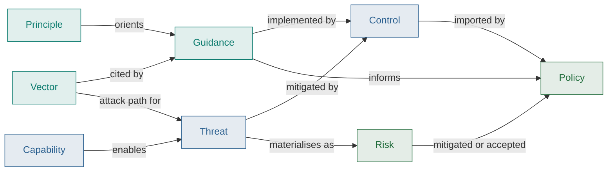

# Governance Definitions

As discussed in the [Governance Twin Factor](/docs/factors/build-a-governance-twin), your 
governance definitions should be a created as a set of structured entities, managed alongside the sensitive 
activity in question.  

For machine-readable shapes, see the
[Gemara schemas](https://gemara.openssf.org/schema/).

## How the definitions connect

The diagram below shows how definition catalogs relate: principles, vectors and
guidance feed controls and risks; policy imports those controls and treats the
risks.

## Definition artifacts

<ArtifactList layers={[1, 2, 3]} />
