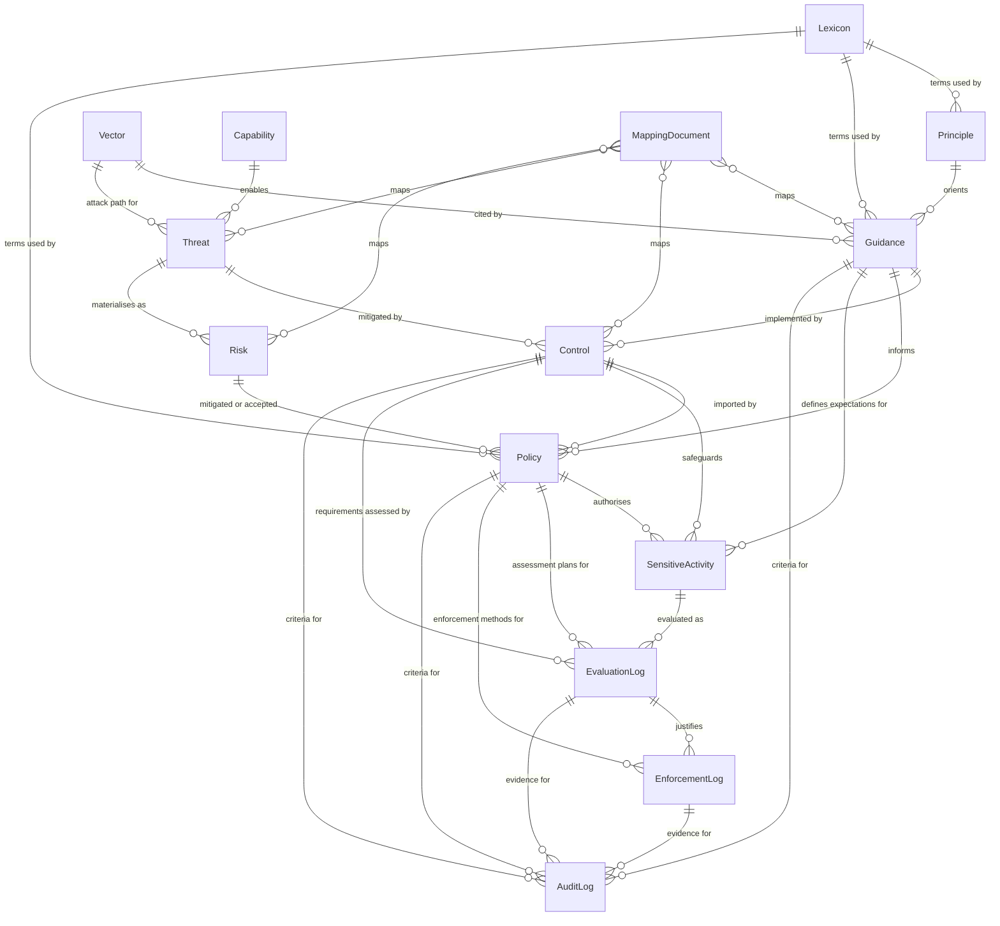

# Governance Artifacts

[Gemara](/docs/tools/gemara) organises automated governance into typed, linkable
artifacts across seven layers. Layers 1–3 **define** what good looks like;
Layer 4 is the **sensitive activity** being governed; Layers 5–7 **measure**
evaluation, enforcement and audit. Each layer has its own colour on artifact
pages and in the map below.

These pages explain what each artifact *is* and how it is used—not the field
layout of the schema. Examples are drawn from a worked FOSS contribution
programme and from published catalogs such as the
[FINOS AI Governance Framework principles](https://grc.store/finos-aigf/air-prin/versions/0.2.0).
For machine-readable shapes, see the
[Gemara schemas](https://gemara.openssf.org/schema/).

## How the artifacts connect

The diagram below shows how those typed artifacts relate: definition catalogs
feed policy and the sensitive activity; measurement logs then evaluate, enforce
and audit against that activity.

<ArtifactLayerMap />

