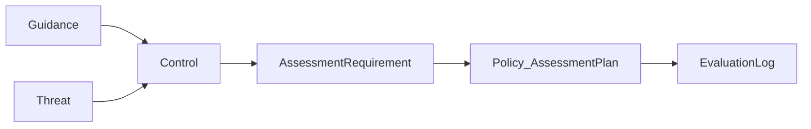

<GovernanceArtifact
  title="Control"
  gemaraType="ControlCatalog"
  layer={2}
>

<Purpose>
Catalog of safeguards that mitigate threats and implement guidance, each with verifiable assessment requirements.
</Purpose>

<LayerRole>
Layer 2 — threats and controls. Controls define *what must be verified*; assessment requirements are written as observable outcomes, not process essays.
</LayerRole>

<WhyYouNeedThis>
Without controls, policy cannot say what to evaluate. Without assessment requirements, evaluation logs have nothing precise to pass or fail.
</WhyYouNeedThis>

<Contains>

- **Control** — `id`, `title`, `objective`, `state`, `group`
- **AssessmentRequirement** — `id`, `text`, `applicability`, `state`
- Links to guidelines and threats

</Contains>

<KeyFields>

- `assessment-requirements[]` as the contract for Layer 5
- `guidelines` and `threats` mappings
- Applicability groups on the catalog and requirements

</KeyFields>

<LinksUpstream>

- [Guidance](/docs/artifacts/layer-1/guidance), [Threat](/docs/artifacts/layer-2/threat)

</LinksUpstream>

<LinksDownstream>

- [Policy](/docs/artifacts/layer-3/policy) assessment plans reference requirement ids
- [Evaluation Log](/docs/artifacts/layer-5/evaluation-log) records results against those plans
- [Audit Log](/docs/artifacts/layer-7/audit-log) may cite controls as criteria

</LinksDownstream>

<Example>

Control that prevents non-public disclosure, with an assessment requirement used by policy plans and evaluation logs:

```yaml
controls:
  - id: foss-ctl-008-data-leakage-review
    title: Non-Public Information Review
    objective: >
      Prevent disclosure of non-public information through FOSS contributions.
    group: information-protection
    state: Active
    assessment-requirements:
      - id: foss-ctl-008-data-leakage-review.ar01
        text: >
          Pre-publication evaluation outputs MUST report no uncleared prohibited
          disclosures before contribution content is published.
        applicability:
          - all-contributions
        recommendation: >
          Use secret scanning, sensitive-data detection, and reviewer sign-off
          before publication; treat uncleared findings as non-compliance.
        state: Active
    guidelines:
      - reference-id: foss-contribution-guidance
        entries:
          - reference-id: foss-guidance-information-classification
    threats:
      - reference-id: foss-contribution-threat-catalog
        entries:
          - reference-id: sensitive-data-disclosure
```

</Example>

<AntiPatterns>

- Assessment requirements that restate process rules instead of observable outcomes
- Controls with objectives but no requirements
- Controls that never cite a threat or guideline

</AntiPatterns>

<Diagram>



</Diagram>

<Discussion>

Controls deliberately separate *intent* (objective, linked guidance) from *verification* (assessment requirement text). That split is what makes Layer 5 logs and Layer 3 plans interoperable.

</Discussion>

<RelatedArtifacts>

- [Guidance](/docs/artifacts/layer-1/guidance)
- [Threat](/docs/artifacts/layer-2/threat)
- [Policy](/docs/artifacts/layer-3/policy)
- [Evaluation Log](/docs/artifacts/layer-5/evaluation-log)

</RelatedArtifacts>

<RelatedFactors>

- [Facts In, Decisions Out](/docs/factors/facts-in-decisions-out)
- [Evidence by Default](/docs/factors/evidence-by-default)
- [Continuous Governance](/docs/factors/continuous-governance)

</RelatedFactors>

<References>

- [Gemara model](https://gemara.openssf.org/model/)
- [Gemara schemas — ControlCatalog](https://gemara.openssf.org/schema/)

</References>

</GovernanceArtifact>
