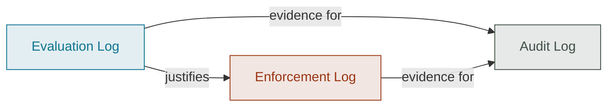

# Governance Measures

Measures are the records produced as a sensitive activity runs: evaluation,
enforcement and audit. They show whether definitions were applied and what
happened next.

## How the measures connect

The diagram below shows how measurement logs relate: evaluation inspects an
activity instance against policy and controls; enforcement acts on those
results; audit reviews both as evidence of programme conformance.

## Measure artifacts

<ArtifactList layers={[5, 6, 7]} />
