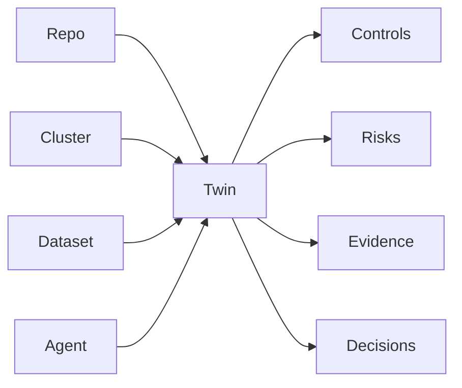

<GovernanceFactor title="Build a Governance Twin">

<Principle>
Maintain a continuously synchronised, machine-readable governance representation of the real resources, activities and relationships.
</Principle>

<Problem>

Policies that apply only to categories in general never become posture. Without a
live representation of concrete resources—and the controls, risks, evidence and
decisions attached to them—governance stays disconnected from source systems and
from the things teams actually operate.

</Problem>

<PositiveExamples>

- A repository twin with provenance, owner and release gates
- A data twin for a regulated bucket
- An AI-agent twin showing approved tools and current exceptions
- A build twin for a release pipeline
- An FDC3 app twin for context-sharing posture

</PositiveExamples>

<NegativeExamples>

- Policies that apply only to “object storage” in general
- CMDB rows with no controls or risks
- Spreadsheets of “critical apps” with no live links to reality
- Dashboards disconnected from source systems

</NegativeExamples>

<Tools>

- Backstage
- ServiceNow CMDB
- Cloud Asset Inventory
- AWS Config
- Gemara
- OSCAL references

</Tools>

<AntiPatterns>

- Governance without inventory
- Inventory without semantics
- One giant undifferentiated enterprise model

</AntiPatterns>

<Diagram>

Real resources feed a twin that holds governance-relevant state: controls, risks, evidence and decisions.

</Diagram>

<Discussion>

Governance becomes operational only when it resolves to something concrete.
Backstage demonstrates the value of typed software entities with owners and
relations; CMDBs do the same for configuration items; Cloud Asset Inventory and
AWS Config keep resource state and relationships searchable over time. A
governance twin extends that pattern by holding not just technical metadata, but
governance-relevant state: controls, risks, evidence, posture, decisions,
exceptions and dependencies.

This factor is also where Gemara’s current strengths and limits become useful.
Gemara is strong on layered governance semantics and logs, but it does not try to
be the authoritative inventory of every concrete resource. In practice, a
governance-twin architecture therefore needs either lightweight resource profiles
of its own or robust references into external inventories. That bridge from
semantics to instances is the step from “policy” to “posture”.

</Discussion>

<RelatedPrinciples>

- Bind Governance to Real Resources
- Resources Are First-Class
- Inventory Everything You Rely On
- Governance Shadow
- Trust Graph
- Show Posture Continuously
- [Govern Dependencies](/docs/factors/govern-dependencies)
- [Governance Has Owners](/docs/factors/governance-has-owners)
- [Continuous Governance](/docs/factors/continuous-governance)

</RelatedPrinciples>

<Interactions>

This factor underpins [Govern Dependencies](/docs/factors/govern-dependencies),
[Governance Has Owners](/docs/factors/governance-has-owners) and
[Continuous Governance](/docs/factors/continuous-governance).

</Interactions>

<References>

- [Backstage](https://backstage.io/)
- [AWS Config](https://aws.amazon.com/config/)
- [Gemara](https://gemara.openssf.org/)
- [OSCAL](https://pages.nist.gov/OSCAL/)

</References>

</GovernanceFactor>
