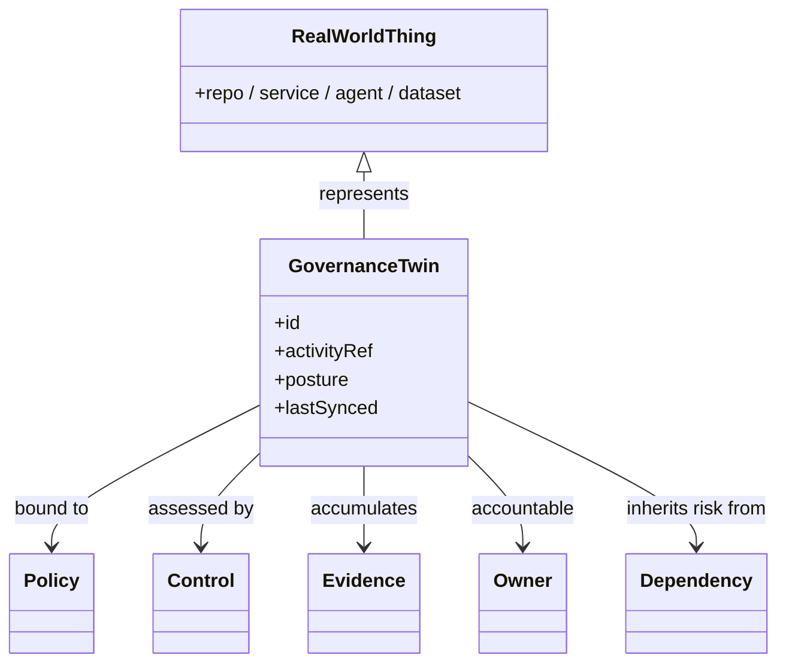

<GovernanceFactor title="Build a Governance Twin" number={2}>

<Principle>

Maintain a continuously synchronised, machine-readable governance representation
of the real resources, activities and relationships you care about.

Once sensitive activities are identified, they must resolve to something
concrete—a twin that holds posture, evidence, owners and dependencies, not only
policy text about categories in general.

</Principle>

<Problem>

Factor I asks *what* deserves governance. Without a live representation of the
things that perform those activities, the answer stays abstract. Policies that
apply only to “object storage”, “applications” or “AI systems” never become
posture: they never attach to a specific repository, bucket, agent or pipeline
you can inspect, escalate or remediate.

Inventories alone are not enough either. A CMDB row or catalogue entry without
controls, risks, evidence and decisions is discoverable but not governable. A
governance twin bridges the gap: it is synchronised with reality and carries the
governance semantics that make accountability and proof possible.

</Problem>

<Characteristics>

<RevealItem title="Bound to real things" defaultOpen>

A twin identifies a concrete resource or activity instance—not a vague category.
If you cannot name the repo, dataset, agent or pipeline, you do not yet have a
twin.

</RevealItem>

<RevealItem title="Governance semantics, not only inventory">

Technical metadata is necessary but insufficient. The twin also holds controls,
risks, evidence, decisions, exceptions and relationships that matter for
governance.

</RevealItem>

<RevealItem title="Continuously synchronised">

Posture drifts when the twin is a quarterly snapshot. Useful twins update as
source systems, pipelines and ownership change.

</RevealItem>

</Characteristics>

<PositiveExamples>

<RevealItem title="A repository twin with provenance, owner and release gates">
Release posture bound to a concrete repo identity—who owns it, what provenance
it emits, and which gates apply—rather than a generic “application” policy.
</RevealItem>

<RevealItem title="A data twin for a regulated bucket">
Storage policy resolved to a specific dataset with controls, risks and evidence
attached, so auditors and operators see the same object.
</RevealItem>

<RevealItem title="An AI-agent twin showing approved tools and current exceptions">
Agent posture made inspectable: which tools are allowed, which deviations are
live, and who accepted the risk.
</RevealItem>

<RevealItem title="A build twin for a release pipeline">
Factory governance state represented separately from the product it ships, so
pipeline failure cannot hide behind a green runtime badge.
</RevealItem>

</PositiveExamples>

<NegativeExamples>

<RevealItem title="Policies that apply only to “object storage” in general">
Never resolve to a bucket, owner or live posture you can act on.
</RevealItem>

<RevealItem title="CMDB rows with no controls or risks">
Inventory without governance semantics—discoverable, but not governable.
</RevealItem>

<RevealItem title="Spreadsheets of “critical apps” with no live links to reality">
Static lists that drift away from the systems they claim to describe.
</RevealItem>

</NegativeExamples>

<AntiPatterns>

<RevealItem title="Governance without inventory">

Beautiful policy catalogues that never resolve to instances. Nobody can say
which real systems the rules cover today.

</RevealItem>

<RevealItem title="Inventory without semantics">

Rich asset lists that stop at hostname and owner nickname. No controls, risks,
evidence or decisions—so nothing to evaluate.

</RevealItem>

<RevealItem title="One giant undifferentiated enterprise model">

A twin of everything that becomes nobody’s twin. Scope twins to the activities
and resources that actually introduce risk.

</RevealItem>

</AntiPatterns>

<Diagram
  title="What does governance know?"
  description="The twin is the live object that links an activity (or resource) to policies, controls, evidence, owners and dependencies."
>

</Diagram>

<Discussion>

Applying this principle means building the representation layer that Factor I
scoped.

1. **Choose the instances** that perform your sensitive activities—repos,
   services, agents, datasets, pipelines.
2. **Give each a twin identity** that systems and people can refer to stably.
3. **Attach governance state**: controls, risks, evidence, decisions, owners and
   dependencies.
4. **Synchronise** with source systems so posture is not a spreadsheet lagging
   reality.
5. **Use twins as the substrate** for versioned policy, continuous evaluation and
   evidence.

This factor deliberately stops short of saying how definitions are stored as
code or how decisions are computed at runtime. Those come next. Factor II
answers: **how do I represent what Factor I said deserves governance?**

</Discussion>

<RelatedFactors>

This factor turns scope into representation. Everything that follows reasons
about twins:

- [Govern Sensitive Activities](/docs/factors/govern-sensitive-activities) — which activities the twin exists to govern
- [Governance is Version Controlled](/docs/factors/governance-is-version-controlled) — how twin-bound definitions evolve as artefacts
- [Govern Dependencies](/docs/factors/govern-dependencies) — how risk propagates across twin relationships
- [Governance Has Owners](/docs/factors/governance-has-owners) — who is accountable for each twin
- [Continuous Governance](/docs/factors/continuous-governance) — how twins are evaluated and updated in the path of change

</RelatedFactors>

<References>

- [Backstage](/docs/tools/backstage) — typed catalogue entities with owners and relations
- [AWS Config](/docs/tools/aws-config) — continuous cloud resource and relationship inventory
- [ServiceNow CMDB](/docs/tools/servicenow-cmdb) — enterprise CI inventory and ownership
- [Cloud Asset Inventory](/docs/tools/cloud-asset-inventory) — cross-project cloud asset graphs
- [Gemara](/docs/tools/gemara) — layered governance semantics a twin can bind to instances
- [OSCAL](/docs/tools/oscal) — portable control and assessment semantics

</References>

</GovernanceFactor>
