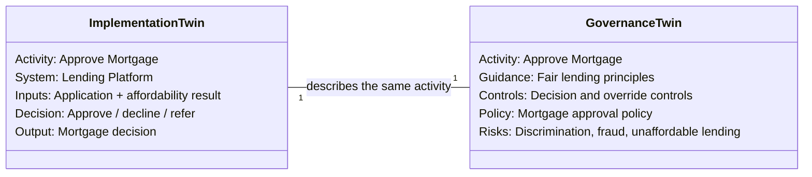

<GovernanceFactor title="Build a Governance Twin" number={2}>

<Principle>

For every sensitive activity implemented in software, maintain a corresponding
Governance Twin that defines how that activity must be governed.

Scope the twin to the activity—not to the whole application, platform or
enterprise.

</Principle>

<Problem>

Identifying a sensitive activity does not make it governable.

A mortgage approval may be implemented across an application form, decision
service, affordability model and case-management system. The implementation
knows how to execute the activity, but it does not necessarily describe why the
activity is sensitive, which organisational policies apply, which risks must be
controlled, or what requirements must be satisfied.

Without a separate governance representation, that knowledge is scattered across
regulations, policy documents, control catalogues, tickets and the assumptions of
individual teams. The organisation may know that mortgage approval should be
governed, but it cannot reliably determine what governing it entails.

A Governance Twin places that governance definition alongside the software
implementation. It creates a concrete, machine-readable representation of how
one specific activity is expected to operate.

See the section on [Governance Artifacts](../artifacts) to see how the governance twin 
is modelled in practice.

</Problem>

<Characteristics>

<RevealItem title="Two twins of the same activity" defaultOpen>

The Implementation Twin and Governance Twin describe the same activity from
different perspectives.

The Implementation Twin describes how the activity is performed: its software
components, inputs, outputs, decisions and runtime behaviour.

The Governance Twin describes how the activity is governed: the guidance it
follows, the risks it creates, the controls it requires and the organisational
policy that authorises it.

Neither replaces the other. Governance must remain connected to implementation,
but should not be hidden inside it.

</RevealItem>

<RevealItem title="Twins evolve together over the lifecycle">

An activity’s Implementation Twin and Governance Twin are not set once and
forgotten. They move together as requirements change.

When the activity is first designed, the Implementation Twin names the intended
components and flows; the Governance Twin records which guidance, controls and
policy will apply. As the system is built and released, implementation details
harden—new services, models or interfaces appear—and the Governance Twin must
gain or tighten the definitions that authorise those behaviours.

In operation, both twins accumulate change: runtime posture and configuration on
the implementation side; evidence, exceptions and risk treatment on the
governance side. A material change to how the activity works—a new decision
path, a different data source, an AI model in the loop—should prompt a
corresponding change to how it is governed, reviewed and versioned.

When the activity is retired or replaced, both twins should close together:
governance definitions are withdrawn or superseded rather than left attached to
software that no longer exists.

</RevealItem>

<RevealItem title="Governance twins are Scoped to a single sensitive activity">

A Governance Twin should be scoped to the sensitive activity being governed.

A lending platform may perform many activities: receiving applications,
verifying identity, calculating affordability, approving mortgages, issuing
documents and disbursing funds.

The Governance Twin for **Approve Mortgage** should describe the governance of
that decision. It should not become a general model of the entire lending
platform (although see [Governance is Composable](governance-is-composable))

Its dependencies may influence its governance, but those relationships are
addressed explicitly in
[Govern Dependencies](/docs/factors/govern-dependencies).

</RevealItem>

</Characteristics>

<PositiveExamples>

<RevealItem title="Mortgage approval in a lending platform">
The Implementation Twin describes the decision service, application inputs and
resulting approval decision. The Governance Twin attaches fair-lending guidance,
approval controls, affordability policy and the risks of discriminatory or
unsuitable lending.
</RevealItem>

<RevealItem title="Trade execution in an order-management system">
The Implementation Twin describes the order, execution venue, trader or
algorithm and resulting trade. The Governance Twin attaches market-conduct
guidance, pre-trade controls, permitted trading policy and risks such as
manipulation or unauthorised trading.
</RevealItem>

<RevealItem title="Privileged-access approval in an identity platform">
The Implementation Twin describes the access request, approver, target system and
granted permissions. The Governance Twin attaches least-privilege guidance,
approval and segregation-of-duties controls, access policy and the risk of
unauthorised administrative access.
</RevealItem>

<RevealItem title="AI-generated credit recommendation">
The Implementation Twin describes the model, supplied customer facts,
recommendation and confidence information. The Governance Twin attaches
responsible-AI principles, bias and explainability controls, credit policy and
risks arising from unfair or unreliable recommendations.
</RevealItem>

</PositiveExamples>

<NegativeExamples>

<RevealItem title="A twin of the lending platform as a whole">
One governance object covering mortgage approval, identity verification,
document production and fund disbursement—too broad to say which requirements
apply to which decision.
</RevealItem>

<RevealItem title="Fair-lending policy with no link to the approval activity">
Organisational policy and controls exist, but nothing associates them with the
actual approval activity in the lending system.
</RevealItem>

<RevealItem title="Decision-service config treated as the policy">
Technical behaviour is assumed to express organisational intent, so nobody can
tell whether the implementation satisfies the policy.
</RevealItem>

</NegativeExamples>

<AntiPatterns>

<RevealItem title="Governing the application rather than the activity">

A single “Lending Platform Governance Twin” combines mortgage approval, identity
verification, document production and fund disbursement. The resulting
governance definition is too broad to say which requirements apply to which
decision.

</RevealItem>

<RevealItem title="Governance disconnected from implementation">

The organisation has fair-lending policies and mortgage controls, but nothing
associates them with the actual approval activity in the lending system.

</RevealItem>

<RevealItem title="Implementation treated as its own governance definition">

The decision service’s configuration is assumed to express organisational
policy. Technical behaviour and governance intent become inseparable, making it
difficult to identify whether the implementation actually satisfies the policy.

</RevealItem>

<RevealItem title="A twin with no governance artefacts">

The activity has a catalogue entry, owner and technical metadata, but no linked
guidance, controls, risks or policy. It is an inventory record, not a Governance
Twin.

</RevealItem>

</AntiPatterns>

<Diagram
  title="How it works ↔ how it is governed"
  description="The Implementation Twin and Governance Twin describe the same sensitive activity from different perspectives."
>

</Diagram>

<Discussion>

A Governance Twin is the governance definition of a specific sensitive activity,
maintained alongside the software that implements it.

Factor I identifies activities that deserve governance—for example, mortgage
approval. Factor II requires the lending system’s implementation of that
activity to have a corresponding governance representation: what the
organisation expects of the activity, why, and under what conditions it may
operate.

Putting this into practice:

1. **Start from a Factor I activity** — name the sensitive activity, not the
   platform that hosts it.
2. **Describe the Implementation Twin** — the components, inputs, decisions and
   outputs that perform the activity.
3. **Build the Governance Twin beside it** — bind guidance, controls, threats,
   policy and risk to that same activity.
4. **Keep the scope tight** — one twin per governed activity; do not collapse
   every platform capability into one object.
5. **Leave later concerns for later factors** — owners, evidence, continuous
   evaluation and dependency graphs attach to this substrate; they are not what
   makes it a Governance Twin.

This factor deliberately stops short of version control, decision engines and
runtime enforcement. Those come next. Factor II answers: **what is the
governance definition of the activity Factor I named?**

</Discussion>

<RelatedFactors>

This factor turns identified activities into governable definitions. Later
factors reason about what attaches to the twin:

- [Govern Sensitive Activities](/docs/factors/govern-sensitive-activities) — which activities need a twin
- [Governance is Version Controlled](/docs/factors/governance-is-version-controlled) — how twin-bound definitions evolve as artefacts
- [Govern Dependencies](/docs/factors/govern-dependencies) — how related activities and systems influence governance
- [Governance Has Owners](/docs/factors/governance-has-owners) — who is accountable for each twin
- [Evidence by Default](/docs/factors/evidence-by-default) — how the twin accumulates proof over time

</RelatedFactors>

<References>

- [Gemara](/docs/tools/gemara) — layered governance artefacts bound to sensitive activities
- [Sensitive Activity](/docs/artifacts/activity/) — Layer 4 activity the twin governs
- [Guidance](/docs/artifacts/definitions/guidance) · [Principle](/docs/artifacts/definitions/principle) — Layer 1 definitions
- [Control](/docs/artifacts/definitions/control) · [Threat](/docs/artifacts/definitions/threat) — Layer 2 definitions
- [Policy](/docs/artifacts/definitions/policy) · [Risk](/docs/artifacts/definitions/risk) — Layer 3 definitions
- [OSCAL](/docs/tools/oscal) — portable control and assessment semantics

</References>

</GovernanceFactor>
