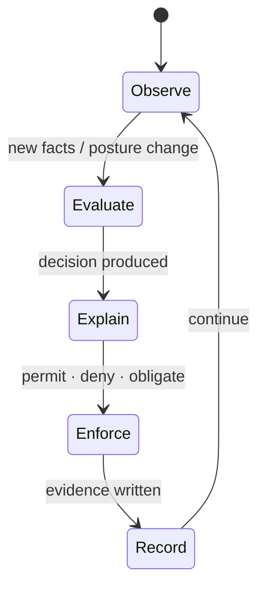

<GovernanceFactor title="Continuous Governance" number={7}>

<Principle>

Governance should run continuously and, where appropriate, in the path of change
and execution.

Observational reporting is not enough. Where risk is created by change, evaluation
should be able to interrupt, condition or remediate—not only describe what already
went wrong.

</Principle>

<Problem>

Governance that only generates reports is observational. Quarterly-only
assessments, failed checks nobody consumes, and approvals that happen after the
action leave risk in the path of change without interruption or remediation.

A twin with stale posture and decision engines that never sit between request and
mutation produce the same failure mode: you learn about risk too late to govern
it.

</Problem>

<Characteristics>

<RevealItem title="In the path of change" defaultOpen>

Where appropriate, evaluate before unsafe state is persisted—admission, promotion,
tool invocation—not only afterwards.

</RevealItem>

<RevealItem title="Closed loop">

Observe → evaluate → explain → enforce → record → observe again. Signals without
consumption are not continuous governance.

</RevealItem>

<RevealItem title="More than hard deny">

Inline control can permit with obligations, escalate for human review, or open
remediation—not only block.

</RevealItem>

</Characteristics>

<PositiveExamples>

<RevealItem title="Admission-time checks on deploys">
Inline evaluation before unsafe state is persisted.
</RevealItem>

<RevealItem title="Run-time audits of existing resources">
Continuous re-checking of what already exists, not only what is changing.
</RevealItem>

<RevealItem title="A denied release that opens remediation">
Enforcement that connects denial to workflow: escalate, fix, re-evaluate.
</RevealItem>

<RevealItem title="Conditional permit with logging and approval">
Inline control that is not only hard deny—obligations and human review in the
path.
</RevealItem>

</PositiveExamples>

<NegativeExamples>

<RevealItem title="Quarterly-only assessments">
Observational cadence that cannot interrupt risky change in time.
</RevealItem>

<RevealItem title="Reports with no effect">
Governance output that nobody consumes to enforce or remediate.
</RevealItem>

<RevealItem title="Approvals that happen after the action">
Post-hoc ceremony that cannot prevent what already occurred.
</RevealItem>

</NegativeExamples>

<AntiPatterns>

<RevealItem title="Governance as reporting only">

Dashboards and PDFs that never sit in the path of change. Useful for awareness;
insufficient for control.

</RevealItem>

<RevealItem title="Deny-only thinking">

Treating continuous governance as a wall of hard blocks. Conditional permit,
obligations and remediation are part of the same loop.

</RevealItem>

<RevealItem title="Post-hoc enforcement">

Discovering violations after the fact and calling it control. Detection without
timely intervention is observation.

</RevealItem>

</AntiPatterns>

<Diagram
  title="How does governance operate continuously?"
  description="A closed loop—observe, evaluate, explain, enforce, record—then observe again."
>

</Diagram>

<Discussion>

Applying this principle means putting evaluation where change happens—and closing
the loop.

1. **Place decision points** on deploy, promote, invoke and other sensitive paths.
2. **Audit continuously** what already exists, not only what is changing.
3. **Connect denials and obligations to workflow**—escalate, remediate, re-evaluate.
4. **Update twin posture** as the loop runs so the next decision sees current
   state.
5. **Prefer explainable inline control** over silent post-hoc reporting.

Admission controllers and audit modes (OPA, Gatekeeper, Kubernetes) show both
halves: evaluate before persistence, and continuously check what already exists.
That is where the twin stops being a model and behaves like a control plane.

</Discussion>

<RelatedFactors>

Continuous operation is where prior factors become control:

- [Facts In, Decisions Out](/docs/factors/facts-in-decisions-out) — the decision shape evaluated in the path
- [Evidence by Default](/docs/factors/evidence-by-default) — what the loop records
- [Build a Governance Twin](/docs/factors/build-a-governance-twin) — posture the loop updates
- [Govern Sensitive Activities](/docs/factors/govern-sensitive-activities) — which paths deserve inline control
- [Governance Has Owners](/docs/factors/governance-has-owners) — who remediates when the loop escalates

</RelatedFactors>

<References>

- [Open Policy Agent](/docs/tools/open-policy-agent) — admission and continuous policy evaluation
- [Gatekeeper](/docs/tools/gatekeeper) — Kubernetes admission and audit modes
- [Kubernetes](/docs/tools/kubernetes) — admission controllers in the path of change
- [Flux](/docs/tools/flux) — policy gates in continuous delivery
- [Gemara](/docs/tools/gemara) — measurement layers that map to evaluate / enforce / audit

</References>

</GovernanceFactor>
