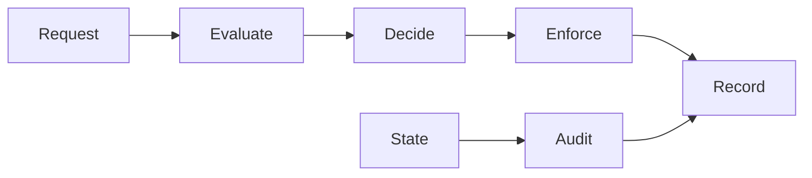

<GovernanceFactor title="Continuous Governance">

<Principle>
Governance should run continuously and, where appropriate, in the path of change and execution.
</Principle>

<Problem>

Governance that only generates reports is observational. Quarterly-only
assessments, failed checks nobody consumes, and approvals that happen after the
action leave risk in the path of change without interruption or remediation.

</Problem>

<PositiveExamples>

- Admission-time checks on deploys
- Run-time audits of existing resources
- A denied production release that opens a remediation flow
- Conditional permit for an AI action with logging and approval
- Continuous posture updates in a twin

</PositiveExamples>

<NegativeExamples>

- Quarterly-only assessments
- Reports with no effect
- Failed checks that nobody consumes
- Approvals that happen after the action

</NegativeExamples>

<Tools>

- Kubernetes admission controllers
- Gatekeeper
- OPA
- Flux-style policy gates
- Workflow engines for remediation

</Tools>

<AntiPatterns>

- Governance as reporting only
- Deny-only thinking
- Post-hoc enforcement

</AntiPatterns>

<Diagram>

Evaluate and decide in the request path; audit existing state; record everything.

</Diagram>

<Discussion>

This factor is where the prior art becomes most operational. OPA for Kubernetes
admission control and Gatekeeper’s audit mode show the two halves of the model
clearly: evaluate requests before persistence, and continuously audit what
already exists. Kubernetes admission controllers are a canonical example of
inline control inserted between authenticated requests and state mutation.
Workflow engines add the piece after a decision: approve, escalate, remediate,
notify, record evidence. Gemara’s measurement layers map well onto the same
loop: evaluate, enforce, audit.

This is also the factor that keeps the microsite from sounding ceremonial.
Governance that only generates reports is observational. Governance that can
interrupt a risky deployment, deny an unsafe context share, require human review
for an AI-produced release, or start a remediation flow is substantive. The
important subtlety is that inline enforcement need not mean hard denial every
time; it can also mean conditional permit plus obligations, or automatic
creation of a workflow for exception handling. That is why decisioning and
workflow orchestration both matter.

This factor is also the best bridge to a live demo. It is the point where the
governance twin stops being a model and starts behaving like a control plane.

</Discussion>

<RelatedPrinciples>

- Continuous Evaluation
- Inline Enforcement
- Explainable Decisions
- Workflow Is Part of Governance
- Show Posture Continuously
- [Facts In, Decisions Out](/docs/factors/facts-in-decisions-out)
- [Evidence by Default](/docs/factors/evidence-by-default)
- [Build a Governance Twin](/docs/factors/build-a-governance-twin)

</RelatedPrinciples>

<Interactions>

This factor depends on [Facts In, Decisions Out](/docs/factors/facts-in-decisions-out)
and [Evidence by Default](/docs/factors/evidence-by-default), and it makes
[Build a Governance Twin](/docs/factors/build-a-governance-twin) visibly useful.

</Interactions>

<References>

- [Open Policy Agent](https://www.openpolicyagent.org/)
- [Gatekeeper](https://open-policy-agent.github.io/gatekeeper/)
- [Kubernetes admission controllers](https://kubernetes.io/docs/reference/access-authn-authz/admission-controllers/)
- [Gemara](https://gemara.openssf.org/)

</References>

</GovernanceFactor>
