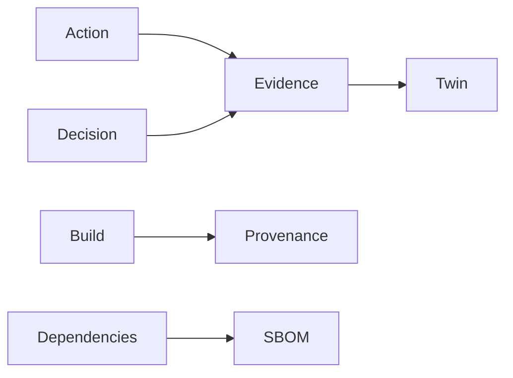

<GovernanceFactor title="Evidence by Default">

<Principle>
Make evidence a normal exhaust of the system, not a special exercise before an audit.
</Principle>

<Problem>

If an audit starts with screenshots, you are already too late. Evidence created
only on request—chat approvals, manual attestation spreadsheets, “evidence
week”—cannot explain posture with receipts, and turns governance into theatre.

</Problem>

<PositiveExamples>

- Build provenance emitted automatically
- SBOMs attached to releases
- Signed assessment results
- Policy decision logs
- Machine-readable approvals and exception expiries

</PositiveExamples>

<NegativeExamples>

- Screenshot collections
- Manual attestation spreadsheets
- “Evidence week” before an audit
- Approvals that exist only in chat

</NegativeExamples>

<Tools>

- SLSA
- in-toto
- CycloneDX
- OSCAL assessment results
- OpenSSF Scorecard

</Tools>

<AntiPatterns>

- Audit theatre
- Unverifiable claims
- Evidence created only on request

</AntiPatterns>

<Diagram>

Actions, decisions, builds and dependencies emit evidence that accumulates on the twin.

</Diagram>

<Discussion>

Supply-chain standards show the pattern clearly. SLSA provenance captures where,
when and how an artefact was produced. in-toto gathers link metadata for each
supply-chain step and verifies the delivered product against an authorised
layout. CycloneDX SBOMs capture components and dependency relationships in
machine-readable form. OSCAL assessment results do the same for control
assessment data. In each case, evidence is generated as part of normal operation
rather than stitched together later.

For a governance microsite, the anti-pattern is easy to state: if your audit
starts with screenshots, you are already too late. A governance twin should
accumulate attributable evidence continuously so that posture is explained by
receipts, not reconstructed by memory. That is what turns dashboards into
defensible governance artefacts.

</Discussion>

<RelatedPrinciples>

- Provenance Before Trust
- SBOM Everywhere
- Auditability by Design
- Immutable Histories
- [Governance is Version Controlled](/docs/factors/governance-is-version-controlled)
- [Govern the Factory and the Product Separately](/docs/factors/govern-factory-and-product-separately)
- [Continuous Governance](/docs/factors/continuous-governance)

</RelatedPrinciples>

<Interactions>

This factor complements [Governance is Version Controlled](/docs/factors/governance-is-version-controlled),
[Govern the Factory and the Product Separately](/docs/factors/govern-factory-and-product-separately)
and [Continuous Governance](/docs/factors/continuous-governance).

</Interactions>

<References>

- [SLSA](https://slsa.dev/)
- [in-toto](https://in-toto.io/)
- [CycloneDX](https://cyclonedx.org/)
- [OSCAL](https://pages.nist.gov/OSCAL/)
- [OpenSSF Scorecard](https://securityscorecards.dev/)

</References>

</GovernanceFactor>
