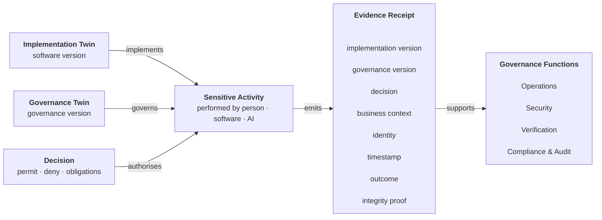

<GovernanceFactor title="Evidence by Default" number={6}>

<Principle>

Every sensitive activity should produce evidence as a normal consequence of performing work.

Evidence is not created for auditors. It is a first-class architectural output of governed systems, allowing decisions to be explained, posture to be verified and governance to be trusted.

</Principle>

<Problem>

Governance cannot be verified without evidence.

Too many organisations generate evidence only when an audit approaches: screenshots are collected, spreadsheets completed and approvals reconstructed from emails or chat messages. These artefacts describe what people believe happened rather than what the system actually recorded.

Governed work should produce its own receipts. Every sensitive activity should automatically emit the evidence needed to explain what happened, who performed it, which governance applied and why the outcome was considered acceptable.

</Problem>

<Characteristics>

<RevealItem title="Evidence is produced automatically" defaultOpen>

Evidence is emitted as a normal consequence of performing governed work—not assembled later for an audit.

</RevealItem>

<RevealItem title="Evidence explains activities">

Evidence should explain what happened, who performed it, when it occurred, which governance applied and why the outcome was permitted.

</RevealItem>

<RevealItem title="Evidence is attributable">

Evidence should be machine-readable, attributable and tamper-evident so it can be independently verified.

</RevealItem>

<RevealItem title="Evidence is non-repudiable">

Evidence should be sufficiently trustworthy that participants cannot credibly deny the activity occurred or dispute the governance under which it was performed. Digital signatures, trusted timestamps, provenance and tamper-evident logs all strengthen non-repudiation.

Digital signatures, software attestations, SLSA provenance, transparency logs and trusted timestamps are all mechanisms for strengthening non-repudiation.

</RevealItem>

<RevealItem title="Evidence is reusable">

The same evidence should support operational dashboards, incident response, compliance reporting and formal audits without being recreated.

</RevealItem>

</Characteristics>

<PositiveExamples>

<RevealItem title="Mortgage approval receipt">
Approval, decision, approver, policy version and customer identifiers are recorded
automatically when the mortgage is approved.
</RevealItem>

<RevealItem title="Release provenance">
Build provenance, SBOMs and signatures are produced automatically as part of
creating a software release.
</RevealItem>

<RevealItem title="Payment authorisation log">
Every payment records the governance decision, obligations satisfied and
resulting transaction identifiers.
</RevealItem>

<RevealItem title="AI tool invocation">
Each tool invocation records the requesting agent, governing decision, data
accessed and resulting actions.
</RevealItem>

</PositiveExamples>

<NegativeExamples>

<RevealItem title="Screenshot Evidence">
A compliance team assembles screenshots before an audit to demonstrate that
controls are configured correctly. The screenshots cannot explain what actually
happened or be regenerated from the governed system.
</RevealItem>

<RevealItem title="Spreadsheet Attestations">
Control owners complete quarterly spreadsheets declaring systems to be compliant.
The evidence is disconnected from the activities it claims to describe.
</RevealItem>

<RevealItem title="Chat-Based Approvals">
Production releases are approved in a chat channel without generating a durable
governance record. Future reviewers cannot determine exactly what was approved or
under which governance.
</RevealItem>

</NegativeExamples>

<AntiPatterns>

<RevealItem title="Audit Theatre">

Evidence is created for auditors instead of being produced by the governed
system.

</RevealItem>

<RevealItem title="Evidence by Exception">

Receipts are generated only for unusual events rather than every sensitive
activity.

</RevealItem>

<RevealItem title="Unattributable Evidence">

Logs and reports cannot be traced back to a specific activity, governance
version or responsible identity.

</RevealItem>

<RevealItem title="Disposable Evidence">

Operational telemetry, provenance and decision logs are discarded once the
activity completes, preventing future verification.

</RevealItem>

</AntiPatterns>

<Diagram
  title="How do we prove compliance?"
  description="Evidence is emitted as the activity happens, then consumed later by auditors and tooling—not reconstructed afterwards."
>

</Diagram>

<Discussion>

Every sensitive activity should produce two outputs: a business outcome and an evidence receipt.

The business outcome is why the activity was performed—a mortgage is approved, a payment is transferred, a software release is deployed. The evidence receipt explains how that outcome came about by recording the implementation version, governance version, decision, identity, timestamp and resulting outcome. Rather than embedding governance definitions themselves, the receipt references the versions that governed the activity, allowing the complete context to be reconstructed later.

Evidence should therefore be treated as a first-class architectural output rather than an administrative afterthought. It should be emitted automatically by the governed system as the activity occurs, not assembled later for compliance exercises or audits. If evidence has to be reconstructed from screenshots, spreadsheets or chat logs, the system has already failed this principle.

Applying this principle means:

1. **Treat every sensitive activity as producing an evidence receipt.**
2. **Record immutable references** to the Implementation Twin, Governance Twin, governing decision and the business context needed to explain the activity.
3. Include sufficient information to establish **attribution, integrity and non-repudiation.**
4. **Allow multiple governance functions to consume the same evidence**, including operations, security, verification and audit.

This pattern already appears in many successful governance technologies. SLSA provenance, in-toto attestations, software signatures, transparency logs, OpenTelemetry traces and audit logs all generate evidence as part of normal operation. The Governance Factors extend this idea beyond software supply chains to every governed sensitive activity.
</Discussion>

<RelatedFactors>

Evidence connects governance decisions and resultant activity to governance verification.

- [Context In, Decisions Out](facts-in-decisions-out) — governance decisions authorise activities; evidence records what actually happened.
- [Continuous Governance](continuous-governance) — verification evaluates evidence to determine governance posture.
- [Build a Governance Twin](build-a-governance-twin) — evidence becomes part of the Governance Twin's operational state.
- [Governance Is Version Controlled](governance-is-version-controlled) — evidence should reference the governance definitions under which it was produced.
- [Govern the Factory and the Product Separately](govern-factory-and-product-separately) — build provenance and runtime evidence belong to different governance domains.

</RelatedFactors>

<References>

- [SLSA](/docs/tools/slsa) — provenance as normal build exhaust
- [in-toto](/docs/tools/in-toto) — signed links for authorised steps
- [CycloneDX](/docs/tools/cyclonedx) — machine-readable composition evidence
- [OSCAL](/docs/tools/oscal) — portable assessment results
- [OpenSSF Scorecard](/docs/tools/openssf-scorecard) — continuous repository posture signals
- [Gemara](/docs/tools/gemara) — semantics for binding evidence to governance layers

</References>

</GovernanceFactor>
