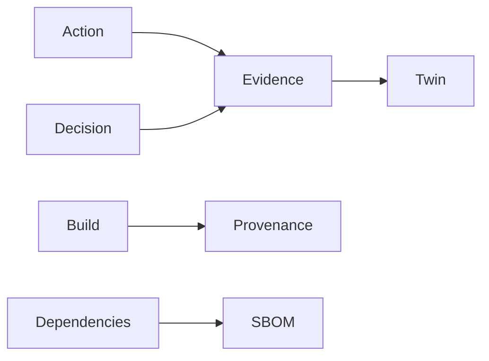

<GovernanceFactor title="Evidence by Default" number={6}>

<Principle>
Make evidence a normal exhaust of the system, not a special exercise before an audit.
</Principle>

<Problem>

If an audit starts with screenshots, you are already too late. Evidence created
only on request—chat approvals, manual attestation spreadsheets, “evidence
week”—cannot explain posture with receipts, and turns governance into theatre.

</Problem>

<PositiveExamples>

<RevealItem title="Build provenance emitted automatically">
Release evidence produced as part of the build, not assembled afterwards.
</RevealItem>

<RevealItem title="SBOMs attached to releases">
Composition evidence that travels with the artefact consumers will verify.
</RevealItem>

<RevealItem title="Signed assessment results">
Control assessment outputs that are attributable and machine-readable.
</RevealItem>

<RevealItem title="Policy decision logs">
Telemetry of what was asked, which policy applied, and what was decided.
</RevealItem>

<RevealItem title="Machine-readable approvals and exception expiries">
Approval and exception state that systems can reconcile without chat archaeology.
</RevealItem>

</PositiveExamples>

<NegativeExamples>

<RevealItem title="Screenshot collections">
Unverifiable images that stand in for system-emitted evidence.
</RevealItem>

<RevealItem title="Manual attestation spreadsheets">
Human-typed claims disconnected from identity, time and integrity.
</RevealItem>

<RevealItem title="“Evidence week” before an audit">
A scramble that proves evidence was not a normal exhaust of operations.
</RevealItem>

<RevealItem title="Approvals that exist only in chat">
Permission granted with no durable, attributable decision record.
</RevealItem>

</NegativeExamples>

<Tools>

- SLSA
- in-toto
- CycloneDX
- OSCAL assessment results
- OpenSSF Scorecard

</Tools>

<AntiPatterns>

- Audit theatre
- Unverifiable claims
- Evidence created only on request

</AntiPatterns>

<Diagram>

Actions, decisions, builds and dependencies emit evidence that accumulates on the twin.

</Diagram>

<Discussion>

Supply-chain standards show the pattern clearly. SLSA provenance captures where,
when and how an artefact was produced. in-toto gathers link metadata for each
supply-chain step and verifies the delivered product against an authorised
layout. CycloneDX SBOMs capture components and dependency relationships in
machine-readable form. OSCAL assessment results do the same for control
assessment data. In each case, evidence is generated as part of normal operation
rather than stitched together later.

For Ten Factor Governance, the anti-pattern is easy to state: if your audit
starts with screenshots, you are already too late. A governance twin should
accumulate attributable evidence continuously so that posture is explained by
receipts, not reconstructed by memory. That is what turns dashboards into
defensible governance artefacts.

</Discussion>

<RelatedPrinciples>

- Provenance Before Trust
- SBOM Everywhere
- Auditability by Design
- Immutable Histories
- [Governance is Version Controlled](/docs/factors/governance-is-version-controlled)
- [Govern the Factory and the Product Separately](/docs/factors/govern-factory-and-product-separately)
- [Continuous Governance](/docs/factors/continuous-governance)

</RelatedPrinciples>

<Interactions>

This factor complements [Governance is Version Controlled](/docs/factors/governance-is-version-controlled),
[Govern the Factory and the Product Separately](/docs/factors/govern-factory-and-product-separately)
and [Continuous Governance](/docs/factors/continuous-governance).

</Interactions>

<References>

- [SLSA](https://slsa.dev/)
- [in-toto](https://in-toto.io/)
- [CycloneDX](https://cyclonedx.org/)
- [OSCAL](https://pages.nist.gov/OSCAL/)
- [OpenSSF Scorecard](https://securityscorecards.dev/)

</References>

</GovernanceFactor>
