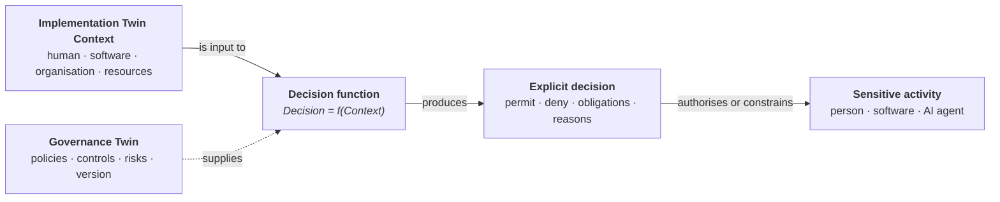

<GovernanceFactor title="Context In, Decisions Out" number={5}>

<Principle>

Governance decisions should be based on the context surrounding a sensitive activity and return an explicit outcome.

Whether an activity is performed by software, people or AI agents, these decisions should be deterministic and inspectable. 

Given the same governance context, you should always expect the same result. This makes governance explainable, testable, reproducible and verifiable.

</Principle>

<Problem>
Too often, governance is hidden inside application code, workflow definitions and operational procedures. The conditions under which a sensitive activity is permitted become implicit rather than explicit, making them difficult to review, test or explain.

A governance system should expose those decisions as explicit evaluations over structured facts. Instead of asking "what did this workflow happen to do?", organisations should be able to ask – after the fact – "given these facts, what governance decision should have been made?"
</Problem>

<Characteristics>

<RevealItem title="Decisions are functions over context" defaultOpen>

Governance evaluates the complete context surrounding a sensitive activity: the
principal, action, resource and any human, organisational or technical context
required to make the decision.

</RevealItem>

<RevealItem title="Decisions are deterministic">

Given the same governance context, the same decision should always be produced.
This makes governance predictable, explainable, testable and reusable across
people, software and AI agents.

</RevealItem>

<RevealItem title="Decisions are explicit">

Decisions should be a distinct step between request and action—not an
opaque side effect buried inside application code or organisational processes.
Every decision should have a clear input, an explicit outcome and an
understandable explanation.

</RevealItem>

<RevealItem title="Decisions are reproducible">

By recording both the context used to make a decision and the decision itself, organisations can reproduce, audit and explain governance decisions long after they were originally made.

</RevealItem>

<RevealItem title="Decisions are side-effect free">

Evaluating governance should never change the state of the system. The decision function should simply evaluate the context and return a decision. Performing the activity—and any resulting side effects such as updating records, sending notifications or transferring funds—belongs to the implementation, not the governance evaluation.

</RevealItem>

</Characteristics>

<PositiveExamples>

<RevealItem title="Mortgage Approval">
The governance decision function evaluates the applicant's identity, affordability,
regulatory constraints and organisational policy before returning a decision to
approve, decline or refer the application.
</RevealItem>

<RevealItem title="Production Deployment">
Before a release is deployed, governance evaluates provenance, approvals,
vulnerability posture and change policy, producing an explicit decision to
deploy, reject or require further review.
</RevealItem>

<RevealItem title="AI Tool Invocation">
Before an AI agent accesses customer information, governance evaluates the
user's authority, data classification, model permissions and organisational
policy to determine whether the request is permitted.
</RevealItem>

<RevealItem title="Payment Authorisation">
The governance decision function evaluates payment amount, customer risk profile,
fraud indicators and approval requirements before authorising or denying the
transfer.
</RevealItem>

</PositiveExamples>

<NegativeExamples>

<RevealItem title="Hidden Mortgage Rules">

A mortgage application decides whether to approve a customer using business rules
embedded throughout the application code. The decision cannot be reviewed, tested
or reused independently of the implementation or without expert assistance.

</RevealItem>

<RevealItem title="Manual Production Deployment Judgement">

An operations engineer decides whether a production deployment should proceed by
interpreting a written runbook. Different engineers may reach different conclusions
because the governance has no explicit decision function.

</RevealItem>

<RevealItem title="Workflow Encoded Governance">

A workflow routes requests through several approval steps, but the conditions for
approval are embedded inside the workflow itself. Changing the parameters of a decision 
now means changing the workflow itself rather than updating the governance.

</RevealItem>

<RevealItem title="AI Agents Making Policy">

An AI agent decides for itself whether it is allowed to invoke a customer database
or payment service. Governance has effectively become part of the agent's reasoning
instead of an independent decision.

</RevealItem>

</NegativeExamples>

<AntiPatterns>

<RevealItem title="Hidden Governance">

Governance decisions are buried inside application code, SQL queries or workflow
definitions where they cannot be reviewed independently.

</RevealItem>

<RevealItem title="Side-Effecting Decisions">

The decision function updates databases, sends emails or performs business
actions instead of simply returning a decision.

</RevealItem>

<RevealItem title="Non-deterministic Decisions">

The same governance context sometimes produces different decisions because hidden
state or external behaviour influences the result.

</RevealItem>

<RevealItem title="Implicit Inputs">

The decision depends on information that is not explicitly supplied as part of
the governance context, making it impossible to explain or reproduce.

</RevealItem>

</AntiPatterns>

<Diagram
  title="How are governance decisions made?"
  description="Governance evaluates the socio-technical context surrounding a sensitive activity and produces an explicit decision."
>

</Diagram>

<Discussion>

Every sensitive activity should have a visible governance decision boundary. Rather than embedding governance inside application code, workflows or human procedures, the implementation should present the relevant context to a decision function and receive an explicit outcome in return. This separates **performing work** from **deciding whether that work is permitted**, allowing governance to be developed, reviewed and tested independently of the implementation.

The decision function should evaluate the complete socio-technical context surrounding the activity, including the human, software, organisational and resource context represented by the Implementation Twin. The Governance Twin provides the policies, controls, risks and decision authority that guide the evaluation. Given the same context and the same Governance Twin, the function should always produce the same decision.

Applying this principle means:

1. **Define the governance context** required to evaluate each sensitive activity.
2. **Expose governance as an explicit decision function** between request and action.
3. **Return structured decisions** including outcomes, obligations and reasons.
4. **Keep decision-making free of side effects**; performing the activity remains the responsibility of the implementation.
5. **Record both the context and the resulting decision** so it can later be verified, explained and audited.

This pattern already exists in many successful governance technologies. **XACML**, **Cedar** and **OPA** all expose policy evaluation as an explicit decision function over structured context. **DMN** applies the same principle to business decisions, separating decision logic from workflow and process orchestration. 

Although these technologies differ in scope and implementation, they embody the same architectural ideas: governance should be a visible, deterministic decision boundary and governance decisions are essentially [pure functions](https://en.wikipedia.org/wiki/Pure_function).

</Discussion>

<RelatedFactors>

- [Govern Sensitive Activities](/docs/factors/govern-sensitive-activities) — identifies the business activities that require explicit governance decisions.
- [Build a Governance Twin](/docs/factors/build-a-governance-twin) — provides the policies, controls, risks and decision authority consumed by the decision function.
- [Governance Is Version Controlled](/docs/factors/governance-is-version-controlled) — ensures decision logic evolves safely, can be reviewed and is reproducible over time.
- [Evidence by Default](/docs/factors/evidence-by-default) — records the governance context and resulting decisions to provide auditability and explainability.
- [Continuous Governance](/docs/factors/continuous-governance) — decisions form part of an ongoing, continuous record of the system over time.

</RelatedFactors>

<References>

- [Cedar](/docs/tools/cedar) — principals, resources, actions and schema’d context
- [Open Policy Agent](/docs/tools/open-policy-agent) — structured input and structured decisions
- [XACML](/docs/tools/xacml) — request/response evaluation and obligations
- [DMN](/docs/tools/dmn) — explicit, business-readable decision logic
- [Gatekeeper](/docs/tools/gatekeeper) — admission-time evaluation of structured requests
- [Gemara](/docs/tools/gemara) — layered artefacts that decision engines can consume

</References>

</GovernanceFactor>
