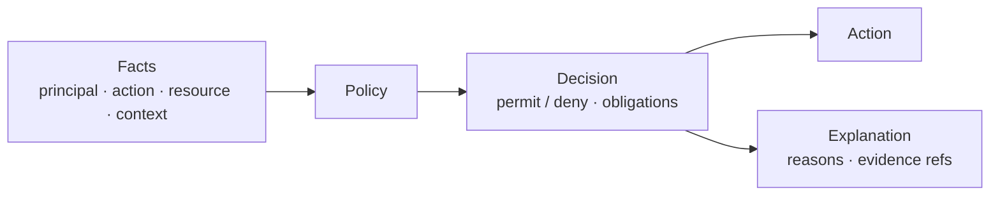

<GovernanceFactor title="Facts In, Decisions Out" number={5}>

<Principle>

Governance decisions should be computed from structured requests and return
explicit results.

A visible decision boundary—facts in, permit/deny/obligations out—turns
governance from tribal memory into something you can inspect, reuse and prove.

</Principle>

<Problem>

Without a defined request shape and an inspectable result, governance becomes a
mixture of scripts, tickets and human memory. Hidden chains and UI-only toggles
cannot explain why they permitted or denied—or what obligations followed.

Sensitive activities need concrete questions: may this principal perform this
action on this resource in this context? If the answer is only a silent state
change, you have automation, not governance.

</Problem>

<Characteristics>

<RevealItem title="Structured facts" defaultOpen>

Inputs have a shape: principal, action, resource and context. Engines and humans
can see what was considered.

</RevealItem>

<RevealItem title="Explicit decisions">

Outputs are more than a boolean when needed: permit, deny, obligations, reasons
and references to evidence.

</RevealItem>

<RevealItem title="A visible boundary">

Policy evaluation is a named step between request and action—not an opaque side
effect buried in a workflow.

</RevealItem>

</Characteristics>

<PositiveExamples>

<RevealItem title="“May this agent call this tool on this dataset?”">
A concrete question with principal, action, resource and context—answerable by an
engine and explainable afterwards.
</RevealItem>

<RevealItem title="“May this branch be promoted?”">
A promotion decision that returns permit/deny, reasons and any obligations.
</RevealItem>

<RevealItem title="Permit with obligations">
A decision that is more than a boolean—encrypt, notify, record—travelling with
the permit into the path of execution.
</RevealItem>

</PositiveExamples>

<NegativeExamples>

<RevealItem title="Hidden script chains">
Outcomes produced by opaque automation with no request/response boundary.
</RevealItem>

<RevealItem title="Approval by tribal knowledge">
Decisions that live only in people’s heads and cannot be audited or reused.
</RevealItem>

<RevealItem title="UI-only toggles with no decision record">
State changes that look like policy but leave no facts, reasons or evidence.
</RevealItem>

</NegativeExamples>

<AntiPatterns>

<RevealItem title="Policy as workflow">

Treating a ticket queue as the decision engine. Workflow can orchestrate
remediation; it should not replace an inspectable policy evaluation.

</RevealItem>

<RevealItem title="Assumptions instead of facts">

Evaluating on implied context that was never stated in the request—so nobody can
reproduce why the decision went the way it did.

</RevealItem>

<RevealItem title="Allow/deny with no rationale">

Opaque results that cannot cite inputs, rules or obligations. Unexplainable
decisions are unverifiable ones.

</RevealItem>

</AntiPatterns>

<Diagram
  title="How are decisions made?"
  description="Facts enter a policy boundary; an explicit decision, action and explanation come out."
>

</Diagram>

<Discussion>

Applying this principle means making every governance decision look like a
question with an answer.

1. **Define the request shape** for each sensitive activity you evaluate.
2. **Put policy evaluation on a visible boundary** between request and action.
3. **Return structured results**—permit/deny, obligations, reasons.
4. **Record the facts and the decision** so evidence can cite them later.
5. **Keep workflow for remediation and escalation**, not as a substitute for
   decisioning.

The lineage is familiar: XACML, Cedar, OPA and DMN differ in style but agree that
the decision boundary must be visible and the request must have a defined shape.

</Discussion>

<RelatedFactors>

Concrete decisions sit on top of scoped activities and feed continuous control:

- [Govern Sensitive Activities](/docs/factors/govern-sensitive-activities) — which questions deserve a decision boundary
- [Continuous Governance](/docs/factors/continuous-governance) — where those decisions interrupt or condition change
- [Evidence by Default](/docs/factors/evidence-by-default) — decision logs as normal exhaust
- [Governance is Version Controlled](/docs/factors/governance-is-version-controlled) — policy logic stored as artefacts
- [Governance Is Composable](/docs/factors/governance-is-composable) — how layered policies combine into one evaluation

</RelatedFactors>

<References>

- [Cedar](/docs/tools/cedar) — principals, resources, actions and schema’d context
- [Open Policy Agent](/docs/tools/open-policy-agent) — structured input and structured decisions
- [XACML](/docs/tools/xacml) — request/response evaluation and obligations
- [DMN](/docs/tools/dmn) — explicit, business-readable decision logic
- [Gatekeeper](/docs/tools/gatekeeper) — admission-time evaluation of structured requests
- [Gemara](/docs/tools/gemara) — layered artefacts that decision engines can consume

</References>

</GovernanceFactor>
