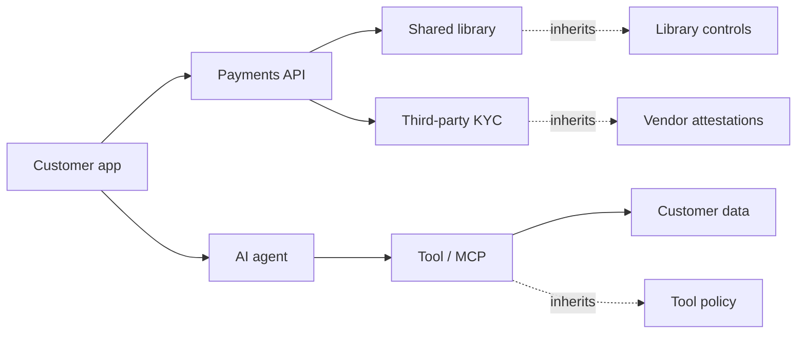

<GovernanceFactor title="Govern Dependencies" number={8}>

<Principle>
Your risks are inherited from your dependencies.
</Principle>

<Problem>

Systems inherit risk from the things they depend upon. Flat inventories and
“just libraries” thinking leave pipelines, tools, models, services and
organisations off the graph—so a green local status can sit on a red edge.

</Problem>

<PositiveExamples>

<RevealItem title="SBOM-backed release gates">
Promotion decisions that consume dependency evidence, not just local tests.
</RevealItem>

<RevealItem title="App twins showing upstream services and data stores">
Inherited posture made visible across service and data edges.
</RevealItem>

<RevealItem title="AI-agent policy that distinguishes approved and unapproved tools">
Agent risk governed through the tools and models it depends on.
</RevealItem>

<RevealItem title="Build pipelines that reason about signing keys and dependencies">
Factory decisions that treat keys and inputs as first-class trust edges.
</RevealItem>

<RevealItem title="Service catalogues with dependency relations">
Catalogue graphs that let governance follow `depends on` links.
</RevealItem>

</PositiveExamples>

<NegativeExamples>

<RevealItem title="Treating dependencies as “just libraries”">
Ignores services, tools, models, pipelines and organisations on the trust graph.
</RevealItem>

<RevealItem title="Green status on a service with a red pipeline">
Local posture that hides inherited factory or upstream failure.
</RevealItem>

<RevealItem title="Approving an agent without tool or model provenance">
Agent trust without knowing what it depends on to act.
</RevealItem>

<RevealItem title="Ignoring transitive risk">
Stopping at direct edges while compromise travels further down the chain.
</RevealItem>

</NegativeExamples>

<Tools>

- CycloneDX
- Backstage relations
- Cloud Asset Inventory
- AWS Config
- ServiceNow CMDB
- NIST C-SCRM guidance

</Tools>

<AntiPatterns>

- Flat inventories
- First-order thinking
- Isolating assets from the graph they live in

</AntiPatterns>

<Diagram
  title="How does risk propagate?"
  description="Dependencies carry inherited governance posture across services, agents and third parties."
>

</Diagram>

<Discussion>

Modern incidents and attacks increasingly look like
`Dependency → Dependency → Dependency → Compromise` or
`Agent → Tool → Data → Exfiltration`. The important point is simple: systems
inherit risk from the things they depend upon. NIST’s supply-chain risk guidance
centres exactly that problem, and standards such as CycloneDX exist to make
component and dependency relationships visible in machine-readable form.
Backstage, CMDBs, AWS Config and Cloud Asset Inventory make the same idea
operational by tracking relationships between entities and resources.

Dependencies are not just libraries. A dependency may be a repository, a human
approver, a cloud service, an AI tool, a model, a workflow or another
organisation. The governance twin therefore needs to represent
`Thing → Depends on → Other Thing`, because posture propagates across those
edges. That is what makes a supply-chain lens, an agent-tool lens and a
service-ownership lens part of the same governance architecture rather than
three separate conversations.

</Discussion>

<RelatedFactors>

- Relationships Matter
- Dependencies Are First-Class
- Attack Paths Matter
- Composition Creates Risk
- Graph the Relationships
- Software Supply Chain Visibility
- [Build a Governance Twin](/docs/factors/build-a-governance-twin)
- [Evidence by Default](/docs/factors/evidence-by-default)
- [Govern the Factory and the Product Separately](/docs/factors/govern-factory-and-product-separately)

</RelatedFactors>

<Interactions>

This factor leans on [Build a Governance Twin](/docs/factors/build-a-governance-twin)
and [Evidence by Default](/docs/factors/evidence-by-default), and it sharpens
[Govern the Factory and the Product Separately](/docs/factors/govern-factory-and-product-separately).

</Interactions>

<References>

- [CycloneDX](https://cyclonedx.org/)
- [Backstage](https://backstage.io/)
- [AWS Config](https://aws.amazon.com/config/)
- [NIST SP 800-161](https://csrc.nist.gov/pubs/sp/800/161/r1/final)

</References>

</GovernanceFactor>
