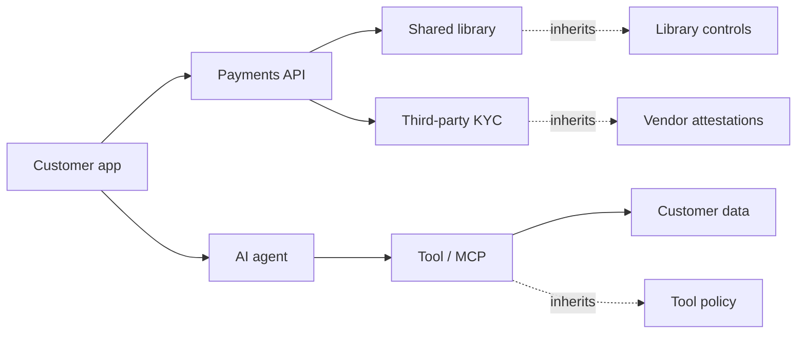

<GovernanceFactor title="Govern Dependencies" number={8}>

<Principle>

Your risks are inherited from your dependencies.

A green local status on a red edge is not a green system. Governance must follow
`depends on` relationships across libraries, services, tools, models, pipelines
and organisations.

</Principle>

<Problem>

Systems inherit risk from the things they depend upon. Flat inventories and
“just libraries” thinking leave pipelines, tools, models, services and
organisations off the graph—so a green local status can sit on a red edge.

Modern incidents often look like
`Dependency → Dependency → Dependency → Compromise` or
`Agent → Tool → Data → Exfiltration`. If the twin cannot represent those edges,
posture cannot propagate and decisions cannot reason about inherited risk.

</Problem>

<Characteristics>

<RevealItem title="Dependencies are first-class" defaultOpen>

Not only libraries: services, tools, models, pipelines, keys, vendors and
organisations belong on the trust graph.

</RevealItem>

<RevealItem title="Posture propagates">

Inherited risk and evidence travel along edges. Local status without upstream
context is incomplete.

</RevealItem>

<RevealItem title="Transitive, not only direct">

Compromise travels further than the first hop. Governance that stops at direct
edges understates attack paths.

</RevealItem>

</Characteristics>

<PositiveExamples>

<RevealItem title="SBOM-backed release gates">
Promotion decisions that consume dependency evidence, not just local tests.
</RevealItem>

<RevealItem title="App twins showing upstream services and data stores">
Inherited posture made visible across service and data edges.
</RevealItem>

<RevealItem title="AI-agent policy that distinguishes approved tools">
Agent risk governed through the tools and models it depends on.
</RevealItem>

<RevealItem title="Service catalogues with dependency relations">
Catalogue graphs that let governance follow `depends on` links.
</RevealItem>

</PositiveExamples>

<NegativeExamples>

<RevealItem title="Treating dependencies as “just libraries”">
Ignores services, tools, models, pipelines and organisations on the trust graph.
</RevealItem>

<RevealItem title="Green status on a service with a red pipeline">
Local posture that hides inherited factory or upstream failure.
</RevealItem>

<RevealItem title="Approving an agent without tool or model provenance">
Agent trust without knowing what it depends on to act.
</RevealItem>

</NegativeExamples>

<AntiPatterns>

<RevealItem title="Flat inventories">

Asset lists without relationships. You can name things and still miss how risk
moves between them.

</RevealItem>

<RevealItem title="First-order thinking">

Governing only the direct edge while transitive compromise remains invisible.

</RevealItem>

<RevealItem title="Isolating assets from their graph">

Evaluating a twin as if it stood alone. Composition creates risk; isolation
hides it.

</RevealItem>

</AntiPatterns>

<Diagram
  title="How does risk propagate?"
  description="Dependencies carry inherited governance posture across services, agents and third parties."
>

</Diagram>

<Discussion>

Applying this principle means putting relationships into the twin and into
decisions.

1. **Model `depends on` edges** for services, libraries, tools, models, pipelines
   and vendors—not only package lists.
2. **Attach inherited posture** so a consumer can see upstream red without
   pretending local green is enough.
3. **Feed dependency evidence into gates**—SBOMs, attestations, catalogue relations.
4. **Follow transitive paths** for high-risk activities, especially agents and
   supply chains.
5. **Keep factory and product edges distinct** where the dependency is build-time
   versus run-time.

Catalogue graphs, cloud inventories and SBOMs make the same idea operational:
posture follows relationships.

</Discussion>

<RelatedFactors>

Dependencies sharpen twin, evidence and factory/product boundaries:

- [Build a Governance Twin](/docs/factors/build-a-governance-twin) — relationships live on twins
- [Evidence by Default](/docs/factors/evidence-by-default) — SBOMs and attestations as edge evidence
- [Govern the Factory and the Product Separately](/docs/factors/govern-factory-and-product-separately) — supply-chain vs service edges
- [Facts In, Decisions Out](/docs/factors/facts-in-decisions-out) — decisions that include dependency facts
- [Continuous Governance](/docs/factors/continuous-governance) — gates that consume inherited posture

</RelatedFactors>

<References>

- [CycloneDX](/docs/tools/cyclonedx) — machine-readable dependency composition
- [Backstage](/docs/tools/backstage) — entity relations on the catalogue graph
- [AWS Config](/docs/tools/aws-config) — cloud resource relationship inventory
- [Cloud Asset Inventory](/docs/tools/cloud-asset-inventory) — cross-project asset graphs
- [ServiceNow CMDB](/docs/tools/servicenow-cmdb) — CI relationships and ownership
- [NIST C-SCRM](/docs/tools/nist-c-scrm) — supply-chain risk as inherited dependency risk

</References>

</GovernanceFactor>
