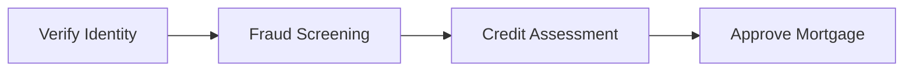

<GovernanceFactor title="Govern Dependencies" number={8}>

<Principle>

Your sensitive activity must trust the things it depends upon.

Whether performed by people, software or AI agents, no activity exists in isolation.  Governance must therefore follow dependency relationships across software, data, services, infrastructure, organisations and other activities, ensuring decisions reflect the complete supply chain rather than just the local component.

</Principle>

<Problem>

Modern software engineering manages complexity by decomposing systems into smaller activities, services, teams and organisations. This distributes responsibility—and with it, risk.

While [every sensitive activity should have a clear owner](governance-has-owners), no activity exists in isolation. Each activity inherits trust, obligations and risk from the upstream activities, systems and organisations upon which it depends. 

If each participant in that supply chain manages its own local risks then no participant manages the risk of the system as a whole and changes that are locally beneficial may unintentionally invalidate the governance assumptions made by downstream activities. 

Your governance twin must therefore reconstruct the workflow supply chain, allowing decisions to consider inherited trust, obligations and risk rather than only the activity immediately in front of them.

</Problem>

<Characteristics>

<RevealItem title="Governance follows the workflow supply chain" defaultOpen>

Every sensitive activity inherits trust, obligations and risk from the upstream activities, systems and organisations upon which it depends. Your Governance Twin should therefore reconstruct the workflow supply chain, allowing governance decisions to reason about the complete chain of trust rather than only the activity immediately in front of them.

</RevealItem>

</Characteristics>

<PositiveExamples>

<RevealItem title="Log4Shell and the open source supply chain">

A bank's trading platform is fully tested and locally compliant, yet inherits a critical vulnerability through an upstream logging library.   Governance follows the software supply chain:  inherited vulnerabilities therefore influence release decisions and patching efforts.

</RevealItem>

<RevealItem title="Governance follows the AI workflow supply chain">

Model versions, evaluation results, tool behaviour and data quality are treated as dependencies of the sensitive activity. Changes anywhere in the AI supply chain trigger re-evaluation before governance assumptions can become stale.

</RevealItem>

<RevealItem title="An international payment workflow">

Governance follows the financial workflow supply chain. Identity verification, fraud detection, sanctions screening, payment networks and correspondent banks all contribute trust, obligations and risk to the decision to execute a payment.

</RevealItem>

<RevealItem title="A cloud-hosted trading platform">

Governance follows the cloud service supply chain. Changes to managed identity, databases, key management and platform services automatically influence governance posture, ensuring the application is governed in the context of the platform upon which it depends.

</RevealItem>

</PositiveExamples>

<NegativeExamples>

<RevealItem title="Treating dependencies as 'just libraries'">

An organisation scans open source dependencies before every release, but ignores the cloud services, AI models, data sources and third-party organisations upon which the application also depends. Governance covers only part of the workflow supply chain, leaving inherited trust and risk outside the decision.

</RevealItem>

<RevealItem title="Green application, red supply chain">

A payment service reports a healthy governance posture, despite depending on a compromised build pipeline and an upstream fraud service operating outside policy. Local governance appears green because inherited posture is never considered.

</RevealItem>

<RevealItem title="Approving an AI agent without governing its dependencies">

An AI agent is approved to perform sensitive activities without considering the provenance of its model, tools or external data sources. The governance decision applies only to the agent itself, not to the workflow supply chain that actually determines its behaviour.

</RevealItem>

<RevealItem title="Unpinned AI models">

A mortgage approval workflow depends on "the latest" version of a language model. A routine upstream model update changes the behaviour of the workflow, invalidating its governance assumptions without any change to the organisation's own software.

</RevealItem>

</NegativeExamples>

<AntiPatterns>

<RevealItem title="Stopping at the first dependency">

Only considering the activities or systems directly connected to a sensitive activity. Governance should follow the workflow supply chain until inherited trust, obligations and risk can no longer materially affect the decision.

</RevealItem>

<RevealItem title="Treating organisational boundaries as trust boundaries">

Assuming risk ends when responsibility passes to another team, supplier or organisation. Ownership can be delegated, but downstream activities still inherit the consequences of upstream decisions.

</RevealItem>

<RevealItem title="Treating every dependency equally">

Every dependency does not contribute the same trust, obligations or risk. Governance should distinguish critical dependencies from incidental ones rather than modelling the entire supply chain with equal weight.

</RevealItem>

<RevealItem title="Static supply chains">

Treating dependency relationships as documentation rather than part of the Governance Twin. Workflow supply chains evolve continuously, and governance should detect and respond when upstream changes invalidate downstream assumptions.

</RevealItem>

</AntiPatterns>
<Diagram
  title="Governance follows the workflow supply chain"
  description="Each sensitive activity trusts the activities that precede it, while contributing obligations and risk to those that follow"
>

Let's say you have these four sensitive activities:

The Governance Twin reconstructs this supply chain so governance decisions reflect inherited trust, obligations and risk across the complete workflow.

| **Sensitive Activity** | **Trusts (Upstream Supply Chain)**                                          | **Obligations (Downstream Supply Chain)**                   | **Risks (Downstream Supply Chain)**                  |
| ---------------------- | -------------------------------------------------------------- | ---------------------------------------------- | --------------------------------------- |
| **Verify Identity**    | Customer identity documents                                    | Record identity evidence                       | Identity fraud                          |
| **Fraud Screening**    | Identity verification                                          | Manual review if fraud score exceeds threshold | Fraud loss                              |
| **Credit Assessment**  | Identity verification Fraud assessment                      | Apply approved lending criteria                | Credit default                          |
| **Approve Mortgage**   | Identity verification Fraud assessment Credit assessment | Record approval and retain evidence            | Regulatory breach Financial exposure |

</Diagram>

<Discussion>

Modern software engineering manages complexity by decomposing systems into smaller, independently owned activities. This allows teams to work autonomously, but it also distributes trust, obligations and risk. 

The same principle already exists in software supply chains. Modern build systems reconstruct the activities that produced a software artefact—source control, dependencies, build pipelines, testing, signing and release—so software can be governed in the context of its complete factory rather than simply the binary that was produced. 

As we saw in the [Govern Factory and Product Separately](govern-factory-and-product-separately) factor, runtime governance and building software are both sensitive activities, so let's compare how a runtime product and a well-run software factory treat this principle:

| **Governance Principle** | **Runtime Product** | **Software Factory** |
|--------------------------|---------------------|----------------------|
| **Model the workflow supply chain** | Model the sensitive activities, systems and organisations that implement the business process. | Model the activities that produce software: source control, build, testing, signing, packaging and release. |
| **Model governance dependencies** | The Governance Twin reconstructs which upstream activities each sensitive activity trusts, together with the obligations and risks inherited from them. | The Governance Twin reconstructs which packages, build activities, test results, signatures and release activities each software artefact trusts. |
| **Evaluate activities in context** | Governance decisions consider the complete workflow supply chain rather than only the local activity. | Release decisions consider the complete software supply chain rather than only the software artefact being released. |
| **Allow governance to propagate** | Changes to upstream activities automatically influence the governance posture of downstream activities that trust them. | New vulnerabilities, dependency updates or policy changes automatically propagate re-evaluation of affected software artefacts. |
| **Optimise the system, not the parts** | Governance optimises the behaviour of the complete business workflow rather than allowing each activity to optimise only its own local risks. | Supply chain security optimises the complete software factory rather than focusing solely on application source code or individual build steps. |

Although software engineers often think about software supply chains and business workflows as separate concerns, they are examples of the same architectural pattern. 

Implementation decomposes systems into independently owned activities; the Governance Twin reconstructs the resulting supply chain so governance can reason about inherited trust, obligations and risk across the system as a whole.

</Discussion>

<RelatedFactors>

Governance supply chains build on the previous factors:

- [Build a Governance Twin](/docs/factors/build-a-governance-twin) — reconstructs the workflow supply chain and its governance relationships.
- [Govern Factory and Product Separately](/docs/factors/govern-factory-and-product-separately) — applies the same principles independently to software factories and runtime products.
- [Context In, Decisions Out](/docs/factors/context-in-decisions-out) — evaluates sensitive activities using inherited trust, obligations and risk.
- [Evidence by Default](/docs/factors/evidence-by-default) — records evidence throughout the supply chain, allowing trust relationships to be verified.
- [Continuous Governance](/docs/factors/continuous-governance) — propagates upstream changes through the supply chain and continuously re-evaluates downstream governance.

</RelatedFactors>
<References>

- [CycloneDX](/docs/tools/cyclonedx) — reconstructs software supply chains from dependency relationships and software bills of materials.
- [Backstage](/docs/tools/backstage) — models services, systems and ownership relationships across the software estate.
- [AWS Config](/docs/tools/aws-config) — discovers cloud resource relationships and tracks how configuration changes propagate.
- [Cloud Asset Inventory](/docs/tools/cloud-asset-inventory) — reconstructs dependency relationships across Google Cloud resources.
- [ServiceNow CMDB](/docs/tools/servicenow-cmdb) — records configuration items, ownership and operational dependencies across enterprise systems.
- [NIST C-SCRM](/docs/tools/nist-c-scrm) — applies supply chain risk management to software, suppliers and third-party dependencies.

</References>

</GovernanceFactor>
