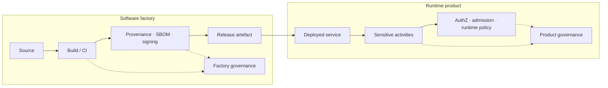

<GovernanceFactor title="Govern the Factory and the Product Separately" number={4}>

<Principle>

The system you run and the system that produces it are different sensitive
activities.

Govern the factory (how artefacts are built, signed and released) separately
from the product (what the running system may do). They are connected, but they
are not the same governance object.

</Principle>

<Problem>

Collapsing build-time and run-time into one score produces misleading posture. A
green product badge can hide a compromised pipeline; release provenance mixed
into end-user access controls obscures which domain failed and who owns the fix.

Supply chains and runtime environments introduce different risks, evidence and
decision points. Treating CI/CD and production as one blob erases that boundary
and leaves teams unable to answer whether failure was in how software was made
or in what it was allowed to do once running.

</Problem>

<Characteristics>

<RevealItem title="Separate sensitive activities" defaultOpen>

Building, signing and releasing are factory activities. Serving users, sharing
data and invoking tools are product activities. Each set deserves its own scope.

</RevealItem>

<RevealItem title="Separate twins and evidence">

Factory posture is provenance, signing and pipeline controls. Product posture is
authorisation, admission and runtime behaviour. Do not force one dashboard to
mean both.

</RevealItem>

<RevealItem title="Connected by artefacts">

The release artefact is the bridge—not a licence to merge the two governance
domains into a single misleading status.

</RevealItem>

</Characteristics>

<PositiveExamples>

<RevealItem title="A build twin with provenance, branch protection and signing">
Factory integrity shown on its own terms: how artefacts were produced and gated
before anyone talks about runtime greenness.
</RevealItem>

<RevealItem title="A run-time twin with authorisation posture and incident history">
Product governance: what the running system may do and how it has behaved, apart
from how it was shipped.
</RevealItem>

<RevealItem title="Separate policies for model training and inference endpoints">
Training-pipeline risk kept distinct from production inference risk—both
governed, neither collapsed.
</RevealItem>

</PositiveExamples>

<NegativeExamples>

<RevealItem title="One “green” score for an app whose build pipeline is compromised">
A single badge that hides factory failure behind product status.
</RevealItem>

<RevealItem title="Release provenance mixed into end-user access controls">
Two domains collapsed so neither set of evidence or owners stays clear.
</RevealItem>

<RevealItem title="Treating CI/CD and production as one blob">
Erases the boundary between how software is made and what it may do when
running.
</RevealItem>

</NegativeExamples>

<AntiPatterns>

<RevealItem title="Pipeline blindness">

Runtime looks healthy while the factory that feeds it is ungoverned. Attackers
and auditors both notice.

</RevealItem>

<RevealItem title="Provenance as a run-time property">

Treating “how it was built” as something you can infer from production config.
You cannot—record it in the factory domain.

</RevealItem>

<RevealItem title="App-level dashboards that hide build risk">

A product traffic light that never surfaces signing, SBOM or pipeline failures.

</RevealItem>

</AntiPatterns>

<Diagram
  title="Where does governance apply?"
  description="Factory and product are connected by artefacts, but each domain has its own controls, twins and evidence."
>

</Diagram>

<Discussion>

Applying this principle means splitting scope deliberately.

1. **Name factory activities** (build, sign, release) and **product activities**
   (serve, share, invoke) as separate sensitive-activity sets.
2. **Give each domain its own twins** and owners.
3. **Collect evidence in the domain that produced it**—provenance in the factory,
   decision logs in the product.
4. **Connect domains via artefacts**, not via a single composite score.
5. **Report posture separately** so green in one place cannot hide red in the
   other.

The vivid test: the product can be green while the factory is red. If your
governance cannot show that, the domains are still collapsed.

</Discussion>

<RelatedFactors>

Separation keeps twin and evidence models honest across the lifecycle:

- [Govern Sensitive Activities](/docs/factors/govern-sensitive-activities) — factory and product are different activity sets
- [Build a Governance Twin](/docs/factors/build-a-governance-twin) — separate twins for each domain
- [Evidence by Default](/docs/factors/evidence-by-default) — provenance vs runtime receipts stay in their domains
- [Govern Dependencies](/docs/factors/govern-dependencies) — supply-chain edges are largely factory; service edges are product
- [Continuous Governance](/docs/factors/continuous-governance) — admission and pipeline gates operate in different paths

</RelatedFactors>

<References>

- [SLSA](/docs/tools/slsa) — provenance requirements for how artefacts are produced
- [in-toto](/docs/tools/in-toto) — verifying authorised factory steps
- [CycloneDX](/docs/tools/cyclonedx) — SBOMs for release composition
- [Open Policy Agent](/docs/tools/open-policy-agent) — runtime and pipeline policy evaluation
- [Gatekeeper](/docs/tools/gatekeeper) — Kubernetes admission for the product domain
- [Kubernetes](/docs/tools/kubernetes) — admission control in the path of change

</References>

</GovernanceFactor>
