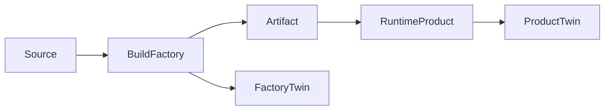

<GovernanceFactor title="Govern the Factory and the Product Separately">

<Principle>
The system you run and the system that produces it are different sensitive activities.
</Principle>

<Problem>

Collapsing build-time and run-time into one governance object produces misleading
status. A green product score can hide a compromised pipeline; release provenance
mixed into end-user access controls obscures which domain failed.

</Problem>

<PositiveExamples>

- A build twin with provenance, branch protection and signing status
- A run-time twin with authorisation posture and incident history
- Separate policies for AI model training pipelines and production inference endpoints
- Distinct governance for desktop app distribution and desktop app context sharing

</PositiveExamples>

<NegativeExamples>

- One “green” score for an app whose build pipeline is compromised
- Release provenance mixed into end-user access controls
- Treating CI/CD and production as one blob

</NegativeExamples>

<Tools>

- SLSA
- in-toto
- CycloneDX
- OPA / Gatekeeper
- FDC3
- Kubernetes

</Tools>

<AntiPatterns>

- Pipeline blindness
- Provenance as a run-time property
- App-level dashboards that hide build risk

</AntiPatterns>

<Diagram>

The factory that produces artefacts and the product that runs them are connected, but separately twinned.

</Diagram>

<Discussion>

Supply-chain standards make this distinction unavoidable. SLSA provenance and
in-toto link metadata describe how artefacts were produced, by which authorised
actors, through which steps. That is governance of the factory. By contrast,
run-time governance tools such as OPA, Gatekeeper and FDC3-facing policy controls
govern what a running system may do with data, peers and users. The build
pipeline and the deployed service are connected, but they are not the same
governance object.

For the microsite, this distinction is a gift because it produces a vivid story.
The product can be green while the factory is red; the desktop app can be
approved to share context while the release pipeline that shipped it is missing
provenance; the agent can be tightly sandboxed while its model-training pipeline
remains opaque. Separate twins make those facts visible instead of collapsing
them into a single misleading status badge.

</Discussion>

<RelatedPrinciples>

- The Factory Is Governed Too
- Provenance Before Trust
- Build Twin
- Runtime Twin
- The Product and Factory Are Separate
- [Build a Governance Twin](/docs/factors/build-a-governance-twin)
- [Evidence by Default](/docs/factors/evidence-by-default)
- [Govern Dependencies](/docs/factors/govern-dependencies)

</RelatedPrinciples>

<Interactions>

This factor relies on [Build a Governance Twin](/docs/factors/build-a-governance-twin)
and strengthens [Evidence by Default](/docs/factors/evidence-by-default) and
[Govern Dependencies](/docs/factors/govern-dependencies).

</Interactions>

<References>

- [SLSA](https://slsa.dev/)
- [in-toto](https://in-toto.io/)
- [CycloneDX](https://cyclonedx.org/)
- [Open Policy Agent](https://www.openpolicyagent.org/)
- [FDC3](https://fdc3.finos.org/)

</References>

</GovernanceFactor>
