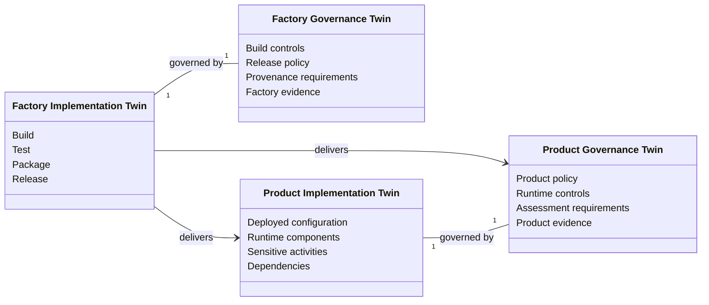

<GovernanceFactor title="Govern the Factory and the Product Separately" number={4}>

<Principle>

The software factory and the running product are different sensitive activities.

Govern the factory (that is, the process by which software  artefacts are developed, tested, built, signed and released) separately
from the product (what the running system may do). 

They are connected, but they are not the same governance object.

</Principle>

<Problem>

Building software and operating software create different organisational risks:

 - A compromised build pipeline may introduce malicious code into every future release. 
 - A compromised runtime system may expose customer data or execute unauthorised business decisions. 
 
Although these events are related, they require different controls, different evidence and often different _owners_ (see [Governance Has Owners](governance-has-owners)).

Regulations increasingly expect organisations to demonstrate both **how software was produced** and **how it behaves once deployed**. 

Collapsing these into a single governance model obscures where failures occurred, which controls were bypassed and which teams are accountable for remediation.

</Problem>

<Characteristics>

<RevealItem title="Separate sensitive activities" defaultOpen>

The software factory performs activities such as building, signing and releasing software. The running product performs activities such as approving payments, serving customers or invoking AI tools. These activities create different risks and should be governed independently.

</RevealItem>

<RevealItem title="Separate twins and evidence">

The software factory performs sensitive activities such as building, signing and releasing software. 
The running product might perform sensitive activities such as approving payments or serving customers.

Build provenance, SBOMs and signing records belong to the factory. Runtime decisions, authorisation events and operational telemetry belong to the product. Mixing evidence reduces clarity and weakens auditability.

</RevealItem>

</Characteristics>

<PositiveExamples>

<RevealItem title="Mortgage Platform">
The factory twin governs how the mortgage platform is built, reviewed and
released. The product twin governs mortgage approvals, customer data access and
fund disbursement.
</RevealItem>

<RevealItem title="AI Fraud Detection">
One governance domain covers model training, evaluation and promotion. The other
governs production inference, decision overrides and customer impact.
</RevealItem>

<RevealItem title="Trading Platform">
The build pipeline governs signed releases and dependency provenance. The
runtime governs trade execution, market controls and operational resilience.
</RevealItem>

</PositiveExamples>

<NegativeExamples>

<RevealItem title="One Governance Dashboard">
A single "green" status hides the fact that the release pipeline has failed
supply-chain validation while production appears healthy.
</RevealItem>

<RevealItem title="Shared Policies">
The same governance policies are applied to both deployment pipelines and
customer-facing applications, leaving neither domain properly governed.
</RevealItem>

<RevealItem title="Shared Ownership">
The same team is assumed to own software production and runtime governance,
making accountability unclear when incidents occur.
</RevealItem>

</NegativeExamples>

<AntiPatterns>

<RevealItem title="Pipeline blindness">

Runtime looks healthy while the factory that feeds it is ungoverned. Attackers
and auditors both notice.

</RevealItem>

<RevealItem title="Provenance as a run-time property">

Treating “how it was built” as something you can infer from production config.
You cannot—record it in the factory domain.

</RevealItem>

<RevealItem title="App-level dashboards that hide build risk">

A product traffic light that never surfaces signing, SBOM or pipeline failures.

</RevealItem>

<RevealItem title="Different Governance for Every Environment">

Creating separate governance definitions for Development, UAT and Production instead of promoting a common governance baseline through progressively more representative environments.  See [Continuous Governance](continuous-governance) for more.

</RevealItem>

</AntiPatterns>

<Diagram
  title="Where does governance apply?"
  description="Factory and product are both sensitive activities, with their own governance twins."
>

</Diagram>

<Discussion>

The software factory and the running product are separate governance domains because they perform different sensitive activities.

The **Factory Implementation Twin** describes how software is built, tested and released. It is governed by the **Factory Governance Twin**, which defines the controls, policies and evidence required before a release may leave the factory. This is where governance is developed, reviewed and verified alongside the implementation.

When a release is promoted, the factory delivers more than executable code:  it delivers the **Product Implementation Twin** together with the **Product Governance Twin** that defines how the deployed software should be governed. The governance created in the factory therefore becomes part of the released product.

</Discussion>

<RelatedFactors>

Separation keeps twin and evidence models honest across the lifecycle:

- [Govern Sensitive Activities](/docs/factors/govern-sensitive-activities) — factory and product are different activity sets
- [Build a Governance Twin](/docs/factors/build-a-governance-twin) — separate twins for each domain
- [Evidence by Default](/docs/factors/evidence-by-default) — provenance vs runtime receipts stay in their domains
- [Govern Dependencies](/docs/factors/govern-dependencies) — supply-chain edges are largely factory; service edges are product
- [Continuous Governance](/docs/factors/continuous-governance) — admission and pipeline gates operate in different paths

</RelatedFactors>

<References>

- [SLSA](/docs/tools/slsa) — provenance requirements for how artefacts are produced
- [in-toto](/docs/tools/in-toto) — verifying authorised factory steps
- [CycloneDX](/docs/tools/cyclonedx) — SBOMs for release composition
- [Open Policy Agent](/docs/tools/open-policy-agent) — runtime and pipeline policy evaluation
- [Gatekeeper](/docs/tools/gatekeeper) — Kubernetes admission for the product domain
- [Kubernetes](/docs/tools/kubernetes) — admission control in the path of change

</References>

</GovernanceFactor>
