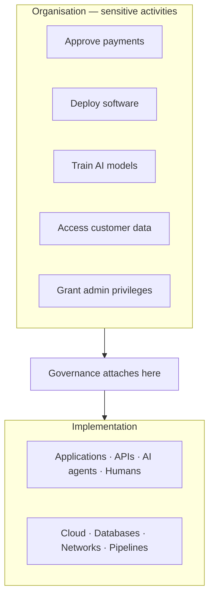

<GovernanceFactor title="Govern Sensitive Activities" number={1}>

<Principle>

Governance should be attached to activities that create risk.

Identify every activity whose incorrect execution could create unacceptable
business, legal, financial, security or safety risk, and make those activities
explicit within your governance model. 

</Principle>

<Problem>

Every organisation performs activities that carry business, legal, regulatory or 
security consequences. Approving a payment, releasing software, accessing customer 
data, granting privileged access, executing a trade or deploying an AI model all 
create obligations that extend beyond the technical systems involved.

Modern regulation increasingly reflects this reality. Frameworks such as GDPR, DORA, 
the EU AI Act, financial services regulations and sector-specific security standards 
are rarely concerned with individual databases, cloud services or APIs. Instead, 
they regulate activities: how decisions are made, who is accountable, what evidence is retained, 
and whether appropriate controls were applied.

Effective governance therefore begins by identifying the activities that create risk.
Technology exists to perform those activities; governance exists to ensure they are 
performed safely, consistently and with appropriate accountability.

</Problem>

<Characteristics>

<RevealItem title="Business impact" defaultOpen>

Not every operation requires governance. Focus on activities whose failure could
materially affect customers, regulators, finances or organisational reputation.

Examples include approving payments, releasing software, modifying production
infrastructure or granting privileged access.

</RevealItem>

<RevealItem title="Human and automated decisions">

Modern systems increasingly delegate decisions to software, workflows and AI
agents. Governance should apply equally whether a decision is made by a person,
a rules engine or a large language model.

</RevealItem>

</Characteristics>

<PositiveExamples>

<RevealItem title="Approving financial transactions">
The movement of money creates financial, legal and regulatory obligations. Every
payment approval should therefore be subject to policy, authorisation and audit.
</RevealItem>

<RevealItem title="Deploying software to production">
A production deployment can introduce outages, vulnerabilities or regulatory
breaches. Governance ensures changes are reviewed, authorised and supported by
appropriate evidence before release.
</RevealItem>

<RevealItem title="Granting privileged access">
Administrative access gives users the ability to change systems, access
sensitive information and bypass normal controls. Such permissions should always
be governed and attributable to an accountable owner.
</RevealItem>

</PositiveExamples>

<NegativeExamples>

<RevealItem title="Rendering a user interface">
Displaying a web page or mobile screen is a routine implementation detail. While
it should be tested for quality, it rarely creates governance obligations in its
own right.
</RevealItem>

<RevealItem title="Compressing or caching data">
Performance optimisations such as compression, caching or image resizing improve
efficiency but generally have no direct business or regulatory significance.
</RevealItem>

<RevealItem title="Formatting logs or reports">
Changing the presentation of information may affect usability, but it does not
usually alter business outcomes or introduce material regulatory risk.
Governance should focus on the decisions being reported, not how they are
displayed.
</RevealItem>

</NegativeExamples>

<AntiPatterns>

<RevealItem title="Governing infrastructure instead of outcomes">

Security teams often know every server they operate but cannot answer which
business activities those servers actually support. That produces excellent
infrastructure governance but poor business governance.

</RevealItem>

<RevealItem title="Treating everything as sensitive">

Attempting to govern every API call, workflow and background process creates
overwhelming complexity. Governance should be proportional to risk—concentrate
effort where failures have meaningful consequences.

</RevealItem>

<RevealItem title="Hidden decision making">

Business decisions embedded inside application code, AI prompts or workflow
engines often escape governance entirely because nobody recognises them as
decision points. If an activity creates risk, it should be visible as something
that can be governed.

</RevealItem>

<RevealItem title="Assuming humans are the only decision makers">

Modern enterprises increasingly rely on automated systems to approve
transactions, generate recommendations and initiate actions. If governance only
considers human decisions, an increasingly large proportion of organisational
risk remains invisible.

</RevealItem>

</AntiPatterns>

<Diagram>

Governance attaches to sensitive activities, regardless of how they are
implemented underneath.

</Diagram>

<Discussion>

Applying this principle does not require building new governance tooling first.
It requires changing *where* governance begins.

1. **Catalogue activities**, not technical assets, as the starting inventory.
2. **Identify which activities** would create unacceptable risk if performed
   incorrectly, without authorisation or without evidence.
3. **Give each sensitive activity a clear business owner** accountable for its
   behaviour.
4. **Define the policies, controls and evidence** that should apply to each
   activity.
5. **Use these activities as the foundation** for the remaining governance
   factors—twins, continuous evidence and runtime policy enforcement.

This factor deliberately stops short of explaining *how* these activities should
be represented in software. The next factor,
[Build a Governance Twin](/docs/factors/build-a-governance-twin), introduces the
machine-readable representation that makes these activities governable by
systems. Factor I is scope: **what deserves governance?** Factor II answers:
**how do I represent that so software can reason about it?**

</Discussion>

<RelatedPrinciples>

- [Build a Governance Twin](/docs/factors/build-a-governance-twin) — how those activities are represented as persistent, machine-readable governance objects
- [Governance is Version Controlled](/docs/factors/governance-is-version-controlled) — once identified, policies and controls for activities should be executable definitions, not documentation alone
- [Evidence by Default](/docs/factors/evidence-by-default) — sensitive activities need ongoing evidence they are operating correctly, not only periodic audits
- [Facts In, Decisions Out](/docs/factors/facts-in-decisions-out) — policies should govern how activities are performed at runtime, whether the actor is a human, application or AI agent
- [Governance Has Owners](/docs/factors/governance-has-owners) — every sensitive activity needs an accountable human

</RelatedPrinciples>

<Interactions>

This factor sets the **scope** of Ten Factor Governance. Everything else hangs
off the activities you choose to govern:
[Build a Governance Twin](/docs/factors/build-a-governance-twin) represents them;
[Facts In, Decisions Out](/docs/factors/facts-in-decisions-out) and
[Continuous Governance](/docs/factors/continuous-governance) decide and enforce
at the moment of action;
[Evidence by Default](/docs/factors/evidence-by-default) proves the activity
stayed within bounds;
[Governance Has Owners](/docs/factors/governance-has-owners) keeps accountability
attached to the activity, not only to the servers underneath it.

</Interactions>

<References>

- [Gemara](/docs/tools/gemara) — activity-centred GRC model with a dedicated sensitive-activity layer
- [Cedar](/docs/tools/cedar) — principal, action, resource and context as the decision shape
- [Open Policy Agent](/docs/tools/open-policy-agent) — evaluate structured activity requests before state changes
- [XACML](/docs/tools/xacml) — classic request/response evaluation for actions on resources

</References>

</GovernanceFactor>
