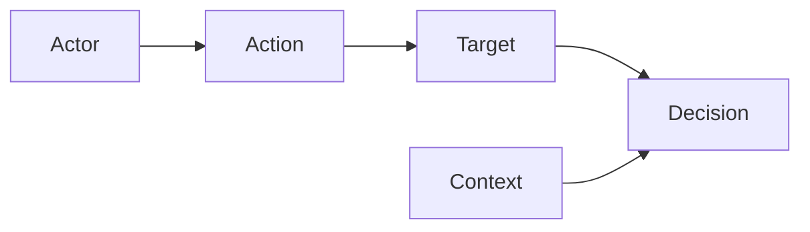

<GovernanceFactor title="Govern Sensitive Activities">

<Principle>
Model governance around the actions that introduce risk.
</Principle>

<Problem>

Governance organised only around static categories and annual checklists never
meets the moment of risk. Without an action model—what a person, system or agent
is about to do—controls stay attached to abstractions, and automated governance
collapses into tidy documentation.

</Problem>

<PositiveExamples>

- Releasing to production
- Sharing FDC3 context between desktop apps
- Approving an AI agent tool call
- Rotating a signing key
- Granting database access

</PositiveExamples>

<NegativeExamples>

- Governing only “applications” as static categories
- Annual control checklists detached from action points
- Risk registers with no action model
- Blanket policy statements such as “AI must be safe”

</NegativeExamples>

<Tools>

- Gemara
- Cedar
- OPA
- XACML
- FDC3
- Kubernetes admission control

</Tools>

<AntiPatterns>

- Document-centric governance
- Hidden approval logic
- Controls attached to categories rather than actions

</AntiPatterns>

<Diagram>

Governance becomes operational when it evaluates what an actor is about to do to a target, in context.

</Diagram>

<Discussion>

Gemara’s explicit treatment of “Sensitive Activities” is a strong foundation for
this factor. Its model places the activity between policy and evaluation, which
captures a simple truth: governance becomes operational when it is asked to
evaluate what a person, system or agent is about to do. That same
activity-centred shape appears elsewhere too: XACML models requests and
responses; Cedar formalises principal, action, resource and context; OPA
evaluates structured input; FDC3 combines context and intents; and Kubernetes
admission control intercepts requests before state changes are persisted.

For the microsite, this factor keeps the whole manifesto grounded. Instead of
starting from abstract catalogues, readers start from concrete moments of risk:
deploy, approve, disclose, invoke, share, sign, grant, delete. Once those
activities are visible, the rest of the architecture follows naturally: which
resources need twins, which evidence matters, where inline enforcement belongs,
and which decisions must be explicit. That is the difference between automated
governance and tidy documentation.

</Discussion>

<RelatedPrinciples>

- Activities Are Typed
- Governance Follows the Activity
- Typed Context In
- Explicit Decision Out
- [Facts In, Decisions Out](/docs/factors/facts-in-decisions-out)
- [Build a Governance Twin](/docs/factors/build-a-governance-twin)
- [Continuous Governance](/docs/factors/continuous-governance)

</RelatedPrinciples>

<Interactions>

This factor drives [Facts In, Decisions Out](/docs/factors/facts-in-decisions-out),
[Continuous Governance](/docs/factors/continuous-governance) and
[Build a Governance Twin](/docs/factors/build-a-governance-twin).

</Interactions>

<References>

- [Gemara](https://gemara.openssf.org/)
- [Cedar](https://www.cedarpolicy.com/)
- [Open Policy Agent](https://www.openpolicyagent.org/)
- [FDC3](https://fdc3.finos.org/)

</References>

</GovernanceFactor>
