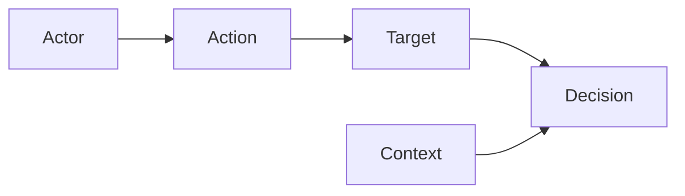

<GovernanceFactor title="Govern Sensitive Activities" number={1}>

<Principle>
Model governance around the actions that introduce risk.
</Principle>

<Problem>

Governance organised only around static categories and annual checklists never
meets the moment of risk. Without an action model—what a person, system or agent
is about to do—controls stay attached to abstractions, and automated governance
collapses into tidy documentation.

</Problem>

<PositiveExamples>

<RevealItem title="Releasing to production">
A concrete sensitive activity where policy can evaluate whether a change may land before state is mutated.
</RevealItem>

<RevealItem title="Sharing context between desktop apps">
An inter-app action with actor, intent and context—exactly the shape an activity-centred gate can decide.
</RevealItem>

<RevealItem title="Approving an AI agent tool call">
A high-risk agent action that should be typed, authorised and evidenced at the point of invocation.
</RevealItem>

<RevealItem title="Rotating a signing key">
A privileged operational action whose approval path and evidence trail must be explicit.
</RevealItem>

<RevealItem title="Granting database access">
An access-grant action that introduces lasting risk and should not hide behind a static “application” category.
</RevealItem>

</PositiveExamples>

<NegativeExamples>

<RevealItem title="Governing only “applications” as static categories">
Treats systems as inventory labels instead of evaluating what they are about to do.
</RevealItem>

<RevealItem title="Annual control checklists detached from action points">
Assessment theatre that never meets deploy, share, grant or invoke moments.
</RevealItem>

<RevealItem title="Risk registers with no action model">
Lists risks without binding them to the activities that create or reduce them.
</RevealItem>

<RevealItem title="Blanket policy statements such as “AI must be safe”">
Sounds governing while providing no evaluable request, decision or evidence path.
</RevealItem>

</NegativeExamples>

<Tools>

- Gemara
- Cedar
- OPA
- XACML
- Kubernetes admission control

</Tools>

<AntiPatterns>

- Document-centric governance
- Hidden approval logic
- Controls attached to categories rather than actions

</AntiPatterns>

<Diagram>

Governance becomes operational when it evaluates what an actor is about to do to a target, in context.

</Diagram>

<Discussion>

Gemara’s explicit treatment of “Sensitive Activities” is a strong foundation for
this factor. Its model places the activity between policy and evaluation, which
captures a simple truth: governance becomes operational when it is asked to
evaluate what a person, system or agent is about to do. That same
activity-centred shape appears elsewhere too: XACML models requests and
responses; Cedar formalises principal, action, resource and context; OPA
evaluates structured input; and Kubernetes
admission control intercepts requests before state changes are persisted.

For Ten Factor Governance, this factor keeps the whole methodology grounded. Instead of
starting from abstract catalogues, readers start from concrete moments of risk:
deploy, approve, disclose, invoke, share, sign, grant, delete. Once those
activities are visible, the rest of the architecture follows naturally: which
resources need twins, which evidence matters, where inline enforcement belongs,
and which decisions must be explicit. That is the difference between automated
governance and tidy documentation.

</Discussion>

<RelatedPrinciples>

- Activities Are Typed
- Governance Follows the Activity
- Typed Context In
- Explicit Decision Out
- [Facts In, Decisions Out](/docs/factors/facts-in-decisions-out)
- [Build a Governance Twin](/docs/factors/build-a-governance-twin)
- [Continuous Governance](/docs/factors/continuous-governance)

</RelatedPrinciples>

<Interactions>

This factor drives [Facts In, Decisions Out](/docs/factors/facts-in-decisions-out),
[Continuous Governance](/docs/factors/continuous-governance) and
[Build a Governance Twin](/docs/factors/build-a-governance-twin).

</Interactions>

<References>

- [Gemara](https://gemara.openssf.org/)
- [Cedar](https://www.cedarpolicy.com/)
- [Open Policy Agent](https://www.openpolicyagent.org/)

</References>

</GovernanceFactor>
