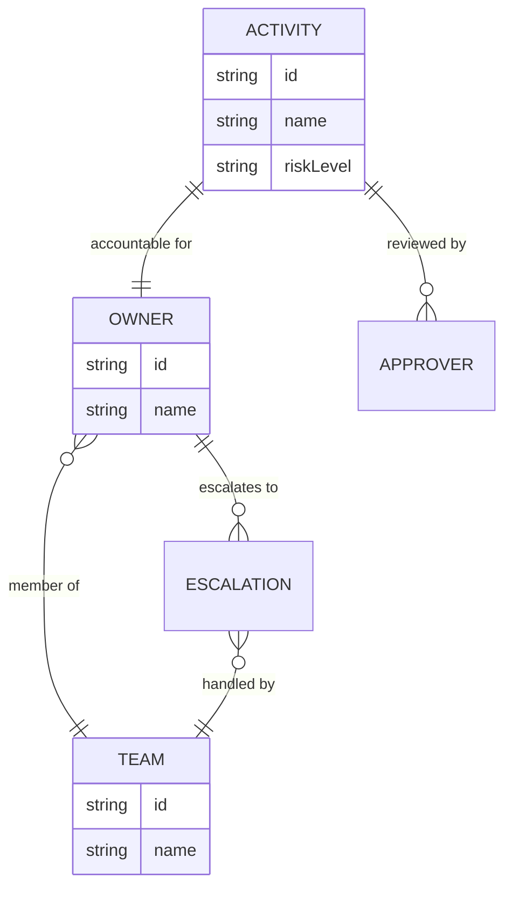

<GovernanceFactor title="Governance Has Owners" number={10}>

<Principle>

Every governed thing must have accountable humans.

If nobody owns it, nobody governs it. Ownership is accountability—not magical
permission inheritance.

</Principle>

<Problem>

One thing that repeatedly kills governance initiatives is that systems,
datasets, repositories and AI agents become governance orphans. Twins without
stewards, exceptions without approvers and incidents assigned to nobody leave the
other factors informational rather than operational.

Platform branding (“platform owns it”) without a person or team is the same
failure mode. Discoverability without a human who can answer, escalate and
accept risk is not ownership.

</Problem>

<Characteristics>

<RevealItem title="Named accountability" defaultOpen>

A person or team that can be contacted, escalated to and held responsible—not a
nickname or shared slogan.

</RevealItem>

<RevealItem title="Coverage of governed things">

Owners for twins, activities, exceptions and remediation—not only for “apps” in
the catalogue.

</RevealItem>

<RevealItem title="Distinct from authorisation">

Ownership answers who is accountable. It does not by itself grant run-time
permission; decision engines still decide.

</RevealItem>

</Characteristics>

<PositiveExamples>

<RevealItem title="A repo with a named owning team">
Clear accountability for a concrete entity, not a nickname with no steward.
</RevealItem>

<RevealItem title="An AI-agent twin with an approver and escalation path">
Ownership for agents where risk acceptance and paging paths are often diffuse.
</RevealItem>

<RevealItem title="A data product with a risk owner">
Someone empowered to accept or refuse risk for a governed dataset.
</RevealItem>

<RevealItem title="Time-bounded exceptions assigned to named approvers">
Exceptions that expire to a person, not to an orphaned inbox.
</RevealItem>

</PositiveExamples>

<NegativeExamples>

<RevealItem title="“Platform owns it” with no person or team">
Shared branding that functions as nobody’s responsibility.
</RevealItem>

<RevealItem title="Orphaned agents">
AI systems with posture but no accountable human behind them.
</RevealItem>

<RevealItem title="Expired exceptions with no reviewer">
Deviation state that outlives accountability.
</RevealItem>

</NegativeExamples>

<AntiPatterns>

<RevealItem title="Shared responsibility as nobody’s responsibility">

Diffuse ownership that looks collective on a slide and vacant in an incident.

</RevealItem>

<RevealItem title="Unnamed approvers">

Exception and risk workflows that route to roles nobody staffs.

</RevealItem>

<RevealItem title="Governance orphans">

Twins, agents and datasets that accumulate posture with no steward who can act.

</RevealItem>

</AntiPatterns>

<Diagram
  title="Who is accountable?"
  description="Activities link to owners and teams, with escalation when responsibility needs to move."
>

</Diagram>

<Discussion>

Applying this principle means making accountability as concrete as the twin.

1. **Require an owner** on every twin and sensitive activity you govern.
2. **Name approvers and escalation paths** for exceptions and high-risk decisions.
3. **Keep ownership visible** in catalogues and twins—steward and contact, not
   only a label.
4. **Separate ownership from authorisation**—accountability is not a substitute
   for a decision engine.
5. **Refuse orphans**—especially AI agents and datasets where ownership is often
   diffuse.

Backstage, SRE and platform engineering rediscovered the same rule: if nobody
owns it, nobody governs it. Without ownership, continuous loops have nowhere to
page and composition has nobody to accept layered risk.

</Discussion>

<RelatedFactors>

Ownership makes the rest of the model operational:

- [Build a Governance Twin](/docs/factors/build-a-governance-twin) — where owners are attached
- [Continuous Governance](/docs/factors/continuous-governance) — who remediates when the loop escalates
- [Governance Is Composable](/docs/factors/governance-is-composable) — who owns each layer and exception
- [Govern Sensitive Activities](/docs/factors/govern-sensitive-activities) — activities that need accountable humans
- [Evidence by Default](/docs/factors/evidence-by-default) — attributable approvals and exception records

</RelatedFactors>

<References>

- [Backstage](/docs/tools/backstage) — ownership and relations at the entity level
- [GitHub CODEOWNERS](/docs/tools/github-codeowners) — named reviewers for code and policy artefacts
- [ServiceNow CMDB](/docs/tools/servicenow-cmdb) — CI stewardship and escalation contacts
- [Gemara](/docs/tools/gemara) — governance semantics that bind to accountable parties

</References>

</GovernanceFactor>
