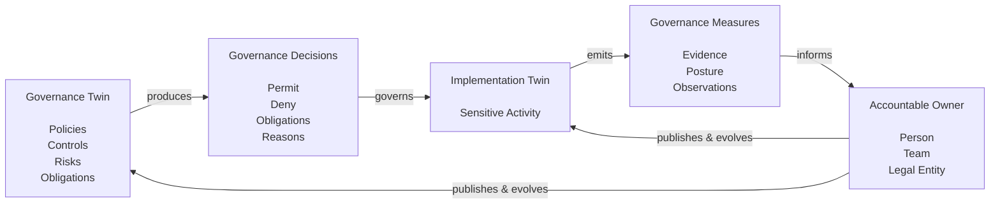

<GovernanceFactor title="Governance Has Owners" number={10}>

<Principle>

Every Governance Twin, governance artefact and governance decision must have a clearly accountable owner. That owner may be an individual, a team or a legal entity, but it must be capable of accepting responsibility for the sensitive activity and the governance it publishes and evolves.

</Principle>

<Problem>

Governance increasingly comes from many sources: regulators, suppliers, open
source projects, internal platform teams and business units. Governance artefacts
can be versioned, composed and continuously evaluated, but those technical
capabilities say nothing about who has the authority to change them, approve
exceptions or answer when governance fails.

Without clear ownership, governance becomes impossible to evolve. Questions
cannot be answered, incidents cannot be escalated, exceptions cannot be approved
and improvements cannot be published. Governance continues to execute, but it no
longer has an accountable organisation standing behind it.

</Problem>

<Characteristics>

<RevealItem title="Owners are accountable" defaultOpen>

Governance derives its authority from the organisations that stand behind it.
Every Governance Twin, governance artefact, governance decision and exception
should identify an accountable owner capable of accepting organisational
responsibility for the governance it publishes.

An owner may be an individual, a team or a legal entity, but it must be capable
of answering questions, approving changes and responding when governance fails.

</RevealItem>

<RevealItem title="Owners are governance engineers">

Governance owners are not simply custodians of documents or approval workflows.
They engineer governance using the same disciplines applied to software:
abstraction, modularity, versioning, testing, automation and continuous
improvement.

Their responsibility is not merely to operate governance, but to evolve it in
response to changing risks, technology and organisational priorities.

</RevealItem>

<RevealItem title="Owners evolve governance">

Evidence, incidents and governance decisions are valuable only if they result in
better governance. Owners review evidence, investigate failures, approve
exceptions and publish improved governance artefacts that can be adopted by the
Governance Twins that depend upon them.

Ownership therefore closes the governance lifecycle by turning operational
experience into better governance.

</RevealItem>

</Characteristics>

<PositiveExamples>

<RevealItem title="NIST publishes SP 800-53">

[NIST](https://nist.gov) publishes [SP 800-53](https://csrc.nist.gov/pubs/sp/800/53/r5/upd1/final) as a versioned governance artefact backed by the authority of the US Government. Organisations around the world build their own governance on top of it because there is a clearly accountable organisation responsible for maintaining, improving and publishing future releases.

</RevealItem>

<RevealItem title="A CISO and product owner respond to a security incident">

- Continuous governance identifies a critical vulnerability affecting a production application. 
- The product owner is responsible for remediating the application, while the CISO decides whether temporary exceptions are acceptable and whether the organisation's governance should change to prevent similar incidents in future. 
- Governance provides the evidence; accountable owners make the organisational decisions.

</RevealItem>

<RevealItem title="A cloud provider stands behind its service">

- A cloud service provider publishes service level agreements, compliance
certifications, security documentation and governance commitments for its object storage service. 
- A financial institution incorporates these commitments into its
own Governance Twin because they form part of the contractual and regulatory
relationship between the two organisations.
- If the provider fails to meet those commitments, the customer can escalate the issue, invoke contractual remedies or ultimately pursue legal action. 
- The governance therefore derives its authority not from the documentation itself, but from the organisation that stands behind it.

</RevealItem>

<RevealItem title="Common Cloud Controls - Published by FINOS">

- The [Common Cloud Controls](/docs/tools/common-cloud-controls) standards are published through the FINOS open governance process, so FINOS is accountable for the project's governance and release process.  
- However, the CCC Steering Committee is accountable for the technical content of each release. 
- Organisations consuming CCC decide independently whether and when to adopt those published releases.

</RevealItem>

</PositiveExamples>

<NegativeExamples>

<RevealItem title="An abandoned open source project">

An organisation depends on governance published by an open source project whose maintainers have disappeared. The governance continues to exist, but there is no accountable organisation capable of accepting changes or responding to newly discovered risks.

</RevealItem>

<RevealItem title="Critical infrastructure maintained by volunteers">

For years, much of the Internet depended upon OpenSSL despite it being maintained by a very small team of volunteers. Heartbleed exposed not only a software vulnerability, but a governance problem: infrastructure relied upon by millions had no organisation with sufficient ownership, funding and engineering capacity standing behind it.

</RevealItem>

<RevealItem title="Shadow AI service without a business owner">

A development team begins using a public LLM to process customer information. The service proves valuable and quickly becomes embedded in business workflows, but no business owner accepts responsibility for approving its use, monitoring its behaviour or deciding when governance should change. The AI becomes operationally important without ever becoming organisationally owned.

</RevealItem>

</NegativeExamples>
<AntiPatterns>

<RevealItem title="Fragmented accountability">

Splitting governance decisions across committees, suppliers, teams and
management until nobody is clearly accountable for the outcome. The Boeing 737
MAX investigations illustrated how diffused organisational accountability can
allow governance failures to emerge even when many capable people participate in
the process.

</RevealItem>

<RevealItem title="A throat to choke">

Appointing an owner simply so somebody can be blamed when things go wrong.
Governance owners need the engineering skills, organisational authority and
resources required to design, evolve and improve governance—not responsibility
without the ability to exercise it.

</RevealItem>

<RevealItem title="Governance orphans">

Governance Twins, published governance artefacts and long-lived exceptions that
outlive their original owners. Governance continues to execute, but nobody
remains capable of evolving it, approving changes or standing behind the
governance.

</RevealItem>

</AntiPatterns>

<Diagram
  title="Accountable Ownership Closes the Feedback Loop"
  description="Governance is not complete until someone stands behind it. This continuous feedback loop turns governance from static documentation into an engineering discipline that continuously improves over time."
>

</Diagram>

<Discussion>

As AI systems become increasingly capable, it is tempting to imagine governance
operating without owners. AI can already evaluate evidence, recommend
governance decisions, draft policies and even propose improvements to
governance itself. Future systems may become capable of operating large parts of
an organisation's governance autonomously.

Ownership, however, is not a technical capability. It is an organisational
relationship. Governance derives its authority from the organisations willing to
stand behind it—to publish it, delegate it, contract upon it and ultimately
answer for its consequences. Today, that authority belongs to accountable
individuals, teams and legal entities rather than the software systems they
operate.

This distinction is familiar throughout software engineering. Organisations
trust operating systems, cloud platforms and open source projects because there
are maintainers, suppliers and organisations standing behind the software they
publish. Governance is no different. A Governance Twin may evaluate decisions
automatically, but the authority for those decisions derives from the owner of
the governance, not the software executing it.

---

Taken together, these ten factors transform governance from a compliance
activity into an engineering discipline: one built from reusable artefacts,
applied through Governance Twins, continuously measured, and ultimately owned by
organisations willing to stand behind the governance they publish.

</Discussion>
<RelatedFactors>

Ownership gives governance organisational authority:

- [Build a Governance Twin](/docs/factors/build-a-governance-twin) — Governance Twins become authoritative only when somebody stands behind them.
- [Continuous Governance](/docs/factors/continuous-governance) — continuous evaluation only improves governance when an accountable owner responds.
- [Governance Is Composable](/docs/factors/governance-is-composable) — every reusable governance artefact requires an owner responsible for publishing and evolving it.
- [Govern Sensitive Activities](/docs/factors/govern-sensitive-activities) — every sensitive activity ultimately requires an accountable owner.
- [Evidence by Default](/docs/factors/evidence-by-default) — evidence enables owners to understand, justify and improve governance decisions.

</RelatedFactors>

<References>

- [NIST SP 800-53](/docs/tools/nist-800-53) — governance published and maintained by an accountable standards organisation.
- [GitHub CODEOWNERS](/docs/tools/github-codeowners) — explicit ownership for engineering artefacts and change approval.
- [Backstage](/docs/tools/backstage) — catalogue ownership and stewardship for software systems.
- [ServiceNow CMDB](/docs/tools/servicenow-cmdb) — accountable owners and escalation contacts for enterprise assets.
- [grc.store](/docs/tools/grc-store) — publishing reusable governance artefacts under accountable ownership.

</References>

</GovernanceFactor>
