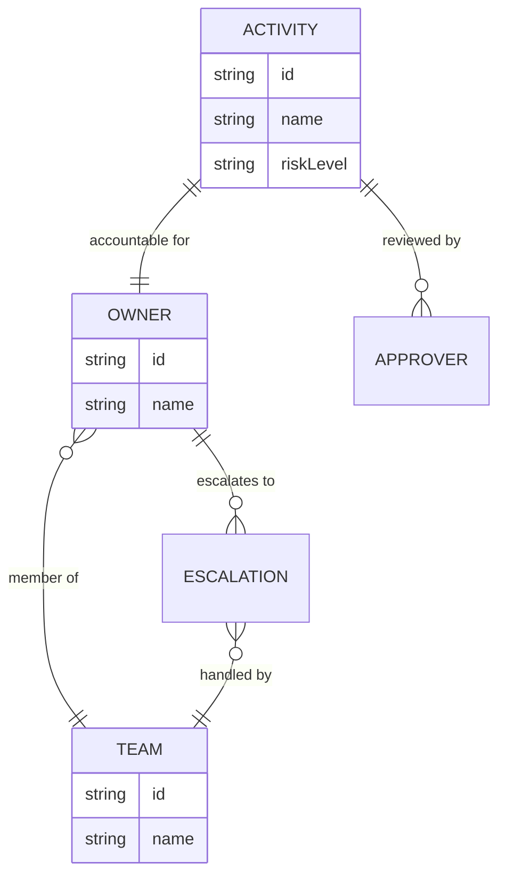

<GovernanceFactor title="Governance Has Owners" number={10}>

<Principle>
Every governed thing must have accountable humans.
</Principle>

<Problem>

One thing that repeatedly kills governance initiatives is that systems,
datasets, repositories and AI agents become governance orphans. If nobody owns
it, nobody governs it—and the other factors become informational rather than
operational.

</Problem>

<PositiveExamples>

<RevealItem title="A repo with a named owning team">
Clear accountability for a concrete entity, not a nickname with no steward.
</RevealItem>

<RevealItem title="An AI-agent twin with an approver and escalation path">
Ownership for agents where risk acceptance and paging paths are often diffuse.
</RevealItem>

<RevealItem title="A data product with a risk owner">
Someone empowered to accept or refuse risk for a governed dataset.
</RevealItem>

<RevealItem title="A service catalogue entry with steward and contact">
Discoverability paired with a human who can answer and escalate.
</RevealItem>

<RevealItem title="Time-bounded exceptions assigned to named approvers">
Exceptions that expire to a person, not to an orphaned inbox.
</RevealItem>

</PositiveExamples>

<NegativeExamples>

<RevealItem title="“Platform owns it” with no person or team">
Shared branding that functions as nobody’s responsibility.
</RevealItem>

<RevealItem title="Orphaned agents">
AI systems with posture but no accountable human behind them.
</RevealItem>

<RevealItem title="Datasets with no steward">
Data products that cannot escalate, remediate or accept risk.
</RevealItem>

<RevealItem title="Expired exceptions with no reviewer">
Deviation state that outlives accountability.
</RevealItem>

<RevealItem title="Incident actions assigned to nobody">
Remediation that cannot land because ownership was never modelled.
</RevealItem>

</NegativeExamples>

<Tools>

- Backstage ownership relations
- CMDB records
- Issue trackers with code owners and approvers
- IAM / group directories
- Service catalogues

</Tools>

<AntiPatterns>

- Shared responsibility as nobody’s responsibility
- Unnamed approvers
- Governance orphans

</AntiPatterns>

<Diagram
  title="Who is accountable?"
  description="Activities link to owners and teams, with escalation when responsibility needs to move."
>

</Diagram>

<Discussion>

One thing that repeatedly kills governance initiatives is that systems,
datasets, repositories and AI agents become governance orphans.

Backstage, Kubernetes, DORA, SRE and modern platform engineering all discovered
the same thing: if nobody owns it, nobody governs it.

A governance twin should therefore include owners, approvers, escalation paths,
delegated authority and stewardship responsibilities. Backstage’s catalogue
model is especially useful here because it makes ownership and relations visible
at the entity level, even while explicitly warning that catalogue ownership is
not itself a run-time authorisation system. That is exactly the right boundary
for this factor: ownership is about accountability, not magical permission
inheritance.

This is especially important for AI systems, where ownership is often diffuse.
Who owns this agent? Who accepts this risk? Who can approve an exception? Who
gets paged? Without ownership, all the other factors become informational rather
than operational.

</Discussion>

<RelatedFactors>

- Everything Has an Owner
- Accountability Is Explicit
- Governance Follows Responsibility
- Named Risk Owners
- [Build a Governance Twin](/docs/factors/build-a-governance-twin)
- [Continuous Governance](/docs/factors/continuous-governance)
- [Governance Is Composable](/docs/factors/governance-is-composable)

</RelatedFactors>

<Interactions>

This factor depends on [Build a Governance Twin](/docs/factors/build-a-governance-twin)
and strengthens [Continuous Governance](/docs/factors/continuous-governance) and
[Governance Is Composable](/docs/factors/governance-is-composable).

</Interactions>

<References>

- [Backstage](https://backstage.io/)
- [GitHub CODEOWNERS](https://docs.github.com/en/repositories/managing-your-repositorys-settings-and-features/customizing-your-repository/about-code-owners)

</References>

</GovernanceFactor>
