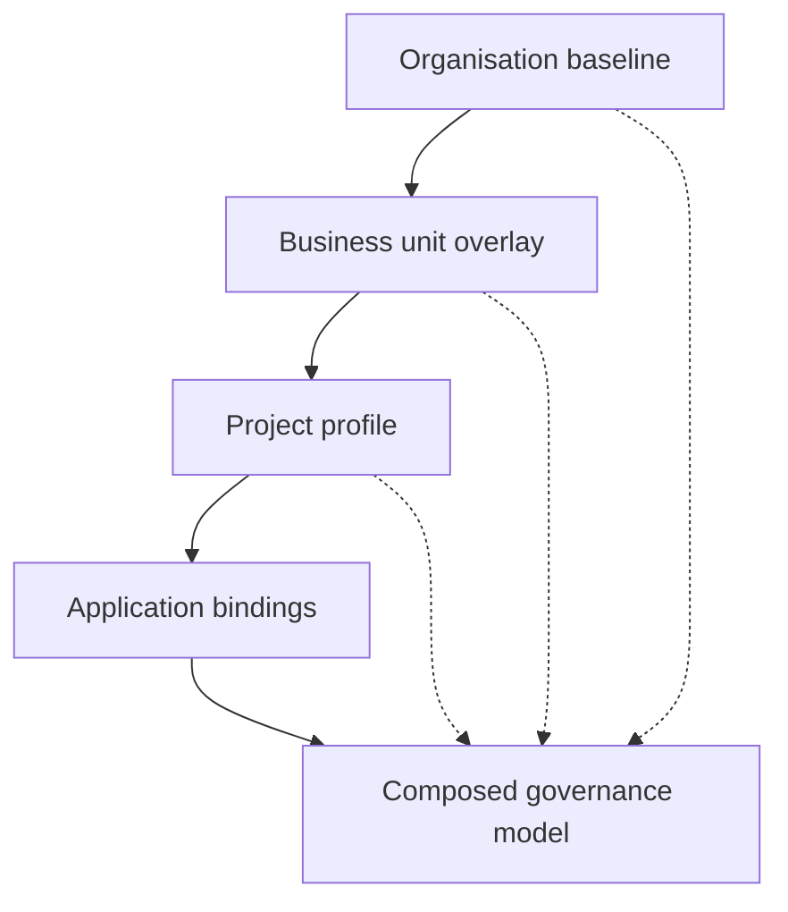

<GovernanceFactor title="Governance Is Composable" number={9}>

<Principle>

Build governance from smaller governance artefacts.

Scale is mostly a composition problem: import, overlay, precedence and
traceable exceptions—not a fresh stack for every product, agent or regulator.

</Principle>

<Problem>

Large organisations are federated. They have enterprise policies, business-unit
policies, project policies, customer overlays and time-bounded exceptions. If
every new product, agent or regulator requires a fresh governance stack—or a
giant monolithic policy file—the model has already failed.

Without import, overlay, precedence and traceable exceptions, teams fork
baselines into private documents until nobody knows what the enterprise standard
is. Scale becomes replacement rather than composition.

</Problem>

<Characteristics>

<RevealItem title="Reusable parts" defaultOpen>

Stable catalogues, templates and profiles that can be specialised without
copy-paste divergence.

</RevealItem>

<RevealItem title="Layering with precedence">

Organisation → business unit → project → application bindings, with explicit
rules for which layer wins.

</RevealItem>

<RevealItem title="Traceable exceptions">

Time-bounded overlays that cite what they modify—not silent edits to the root
baseline.

</RevealItem>

</Characteristics>

<PositiveExamples>

<RevealItem title="Enterprise controls tailored into team profiles">
Shared baselines specialised without forking the whole catalogue.
</RevealItem>

<RevealItem title="Shared policy templates with local bindings">
Reusable decision shapes applied to specific principals and resources.
</RevealItem>

<RevealItem title="Layered exceptions">
Time-bounded overlays with explicit precedence instead of root-policy edits.
</RevealItem>

<RevealItem title="One catalogue reused across multiple twins">
Stable semantics applied many times without copy-paste divergence.
</RevealItem>

</PositiveExamples>

<NegativeExamples>

<RevealItem title="One giant monolithic policy file">
A single blob that cannot be reused, tailored or reasoned about in parts.
</RevealItem>

<RevealItem title="Copy-paste forks for every team">
Baselines that diverge until nobody knows what the enterprise standard is.
</RevealItem>

<RevealItem title="“Replace the whole framework” programmes">
Replacement culture instead of assembling from smaller artefacts.
</RevealItem>

</NegativeExamples>

<AntiPatterns>

<RevealItem title="Monolith governance">

One indivisible stack that must be rewritten to change anything. Composition is
impossible by design.

</RevealItem>

<RevealItem title="Uncontrolled forks">

Local copies that diverge without import lineage or merge path back to the
baseline.

</RevealItem>

<RevealItem title="Inheritance with no override rules">

Layers that stack without precedence. Nobody can explain which rule won or why.

</RevealItem>

</AntiPatterns>

<Diagram
  title="How can governance be reused?"
  description="Compose layered modules from organisation down to application into one evaluated model."
>

</Diagram>

<Discussion>

Applying this principle means assembling governance instead of replacing it.

1. **Publish stable baselines** as versioned catalogues and templates.
2. **Specialise via profiles and overlays**, not forks of the whole stack.
3. **Define precedence** so composed evaluation can show which rule won.
4. **Bound local parameters** (principals, resources, twins) without rewriting
   shared logic.
5. **Track exceptions as overlays** with owners and expiry.

OSCAL profiles, XACML combining algorithms and Cedar templates all encode the
same idea: federated organisations need composition, not replacement.

</Discussion>

<RelatedFactors>

Composition keeps versioned artefacts scalable and owned:

- [Governance is Version Controlled](/docs/factors/governance-is-version-controlled) — composable parts stored as artefacts
- [Governance Has Owners](/docs/factors/governance-has-owners) — who owns each layer and exception
- [Facts In, Decisions Out](/docs/factors/facts-in-decisions-out) — composed policies evaluated at a decision boundary
- [Build a Governance Twin](/docs/factors/build-a-governance-twin) — where bindings attach to instances
- [Govern Sensitive Activities](/docs/factors/govern-sensitive-activities) — scope that profiles specialise

</RelatedFactors>

<References>

- [OSCAL](/docs/tools/oscal) — profiles that import, merge and modify catalogues
- [Cedar](/docs/tools/cedar) — reusable policy templates with local bindings
- [XACML](/docs/tools/xacml) — policy and rule-combining algorithms
- [Gemara](/docs/tools/gemara) — layered artefacts and mappings
- [Open Policy Agent](/docs/tools/open-policy-agent) — modular policy packages composed at evaluation time

</References>

</GovernanceFactor>
