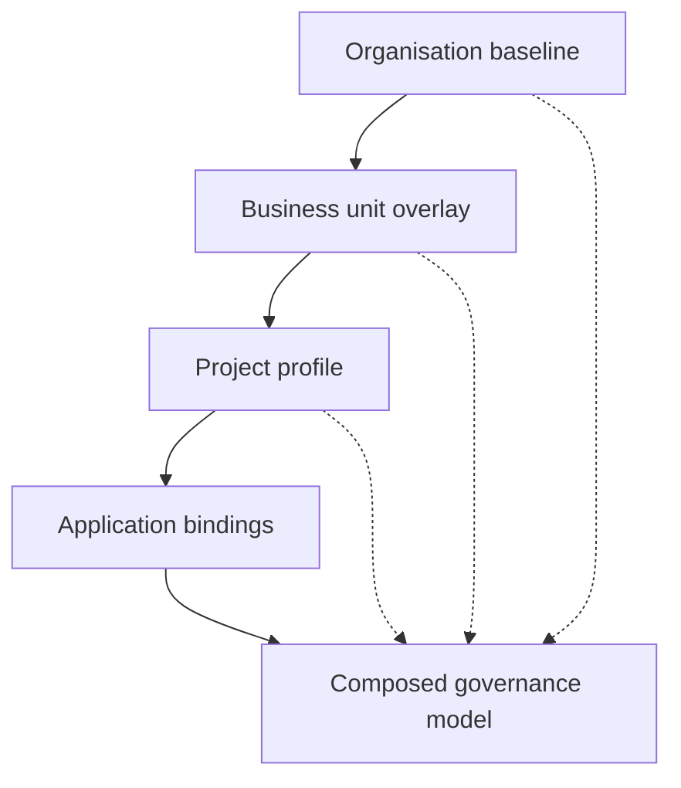

<GovernanceFactor title="Governance Is Composable" number={9}>

<Principle>
Build governance from smaller governance artefacts.
</Principle>

<Problem>

Large organisations are federated. If every new product, agent or regulator
requires a fresh governance stack—or a giant monolithic policy file—the model
has already failed. Without import, overlay, precedence and traceable
exceptions, scale becomes replacement rather than composition.

</Problem>

<PositiveExamples>

<RevealItem title="Enterprise controls tailored into team profiles">
Shared baselines specialised without forking the whole catalogue.
</RevealItem>

<RevealItem title="Shared policy templates with local bindings">
Reusable decision shapes applied to specific principals and resources.
</RevealItem>

<RevealItem title="Layered exceptions">
Time-bounded overlays with explicit precedence instead of root-policy edits.
</RevealItem>

<RevealItem title="One catalogue reused across multiple twins">
Stable semantics applied many times without copy-paste divergence.
</RevealItem>

<RevealItem title="Policy sets combined with explicit precedence">
Composition that can show which rule won and why.
</RevealItem>

</PositiveExamples>

<NegativeExamples>

<RevealItem title="One giant monolithic policy file">
A single blob that cannot be reused, tailored or reasoned about in parts.
</RevealItem>

<RevealItem title="Copy-paste forks for every team">
Baselines that diverge until nobody knows what the enterprise standard is.
</RevealItem>

<RevealItem title="Local spreadsheets that duplicate central controls">
Shadow catalogues that break composition and auditability.
</RevealItem>

<RevealItem title="“Replace the whole framework” governance programmes">
Replacement culture instead of assembling from smaller artefacts.
</RevealItem>

</NegativeExamples>

<Tools>

- OSCAL profiles
- Cedar policy templates
- XACML combining algorithms
- Gemara mappings and layered artefacts

</Tools>

<AntiPatterns>

- Monolith governance
- Uncontrolled forks
- Inheritance with no override rules

</AntiPatterns>

<Diagram
  title="How can governance be reused?"
  description="Compose layered modules from organisation down to application into one evaluated model."
>

</Diagram>

<Discussion>

Large organisations are federated. They have enterprise policies, business-unit
policies, project policies, customer overlays, and time-bounded exceptions.
Governance systems therefore need composition rather than replacement. OSCAL
profiles are a particularly clean example: they can import, merge and modify
controls from one or more catalogues, and can themselves serve as sources for
further profiles. XACML formalises policy and rule-combining algorithms, while
Cedar supports reusable policy templates that are later bound to specific
principals and resources.

This matters because scale is mostly a composition problem. If every new
product, agent or regulator requires a fresh governance stack, the model has
already failed. A better approach is to assemble governance from reusable parts:
stable semantics, reusable controls, local overlays, explicit precedence and
traceable exceptions. That makes governance flexible without making it vague.

</Discussion>

<RelatedFactors>

- Federated Governance
- Policy Layering
- Policy Reuse
- Profiles and Overlays
- [Governance is Version Controlled](/docs/factors/governance-is-version-controlled)
- [Governance Has Owners](/docs/factors/governance-has-owners)
- [Facts In, Decisions Out](/docs/factors/facts-in-decisions-out)

</RelatedFactors>

<Interactions>

This factor builds on [Governance is Version Controlled](/docs/factors/governance-is-version-controlled)
and supports [Governance Has Owners](/docs/factors/governance-has-owners) and
[Facts In, Decisions Out](/docs/factors/facts-in-decisions-out).

</Interactions>

<References>

- [OSCAL](https://pages.nist.gov/OSCAL/)
- [Cedar](https://www.cedarpolicy.com/)
- [Gemara](https://gemara.openssf.org/)

</References>

</GovernanceFactor>
