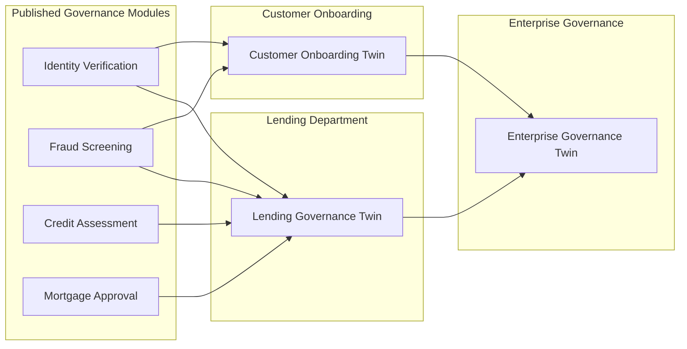

<GovernanceFactor title="Governance Is Composable" number={9}>

<Principle>

Governance should be composed from reusable, versioned governance artefacts rather than rewritten for every product, project or organisation.

</Principle>

<Problem>

Large organisations are federated. They have enterprise policies, business-unit
policies, project policies, customer overlays and time-bounded exceptions. If
every new product, agent or regulator requires a fresh governance stack—or a
giant monolithic policy file—the model has already failed.

Without import, overlay, precedence and traceable exceptions, teams fork
baselines into private documents until nobody knows what the enterprise standard
is. Scale becomes replacement rather than composition.

</Problem>

<Characteristics>

<RevealItem title="Reference released governance" defaultOpen>

Governance should be consumed from released, versioned artefacts rather than
copied into every Governance Twin. Referencing preserves provenance, makes
dependencies explicit and allows governance to evolve independently of the twins that consume it.

A Governance Twin can reference a released version of a Common Cloud Controls catalogue. Like a software dependency, the referenced artefact has an explicit version, can evolve independently and can be upgraded when the consuming organisation is ready.

<CodeExample
  title="Referencing Released Governance"
  type="Gemara"
  caption="A Gemara control catalogue references a released threat catalogue by identifier, version and location. Governance Twins consume published governance artefacts in the same way software consumes versioned libraries."
>
```yaml
title: FOSS Contribution Control Catalog

metadata:
  id: foss-contribution-controls
  type: ControlCatalog
  ...
  mapping-references:
    - id: foss-contribution-threat-catalog
      title: FOSS Contribution Threat Catalog
      version: "0.1.0"
      url: https://some.store.url/foss-threats-0.1.0.yaml

controls:
  - id: foss-ctl-001-project-classification
    title: FOSS Project Category Classification
    objective: >
      Ensure every employee FOSS contribution activity is classified into one
      of four project categories and that governed contribution does not proceed
      without the correct category on record.
    ...
    threats:
      - reference-id: foss-contribution-threat-catalog
        entries:
          - reference-id: ungoverned-contribution-activity
 ...   

```
</CodeExample>

</RevealItem>

<RevealItem title="Extend shared governance">

Shared governance should define reusable baselines that can be specialised for a
particular organisation, product or sensitive activity. Specialisation retains
the relevant parts of the shared baseline while adding more specific controls,
obligations or assessment requirements.

For example, an organisation can import the relevant Common Cloud Controls for
object storage and add controls governing its own use of personal data. The
resulting catalogue remains connected to the shared CCC definitions without
copying or modifying them, while introducing governance specific to the
organisation and its regulatory context.

<CodeExample
  title="Extending a Shared Governance Baseline"
  type="Gemara"
  caption="An organisation imports selected Common Cloud Controls for object storage, then adds its own personal-data control and assessment requirements. The shared baseline remains independently versioned and can be upgraded deliberately."
>
```yaml
...

metadata:
  mapping-references:
    - id: ccc-objstor-controls
      title: Common Cloud Controls Object Storage Catalog
      version: "2026.06"
      url: https://grc.store/ccc/object-storage-controls/2026.06
    - id: ccc-core-threats
      title: Common Cloud Controls Core Threat Catalog
      version: "2026.06"
      url: https://grc.store/ccc/core-threats/2026.06
  ...

imports:
  - reference-id: ccc-objstor-controls
    entries:
      - reference-id: CCC.ObjStor.CN01
        remarks: Prevent Requests to Buckets or Objects with Untrusted KMS Keys
      - reference-id: CCC.ObjStor.CN02
        remarks: Log All Access and Changes
      - reference-id: CCC.ObjStor.CN03
        remarks: Prevent Bucket Deletion Through Irrevocable Bucket Retention Policy
      ...
       
controls:
  - id: Org.PersonalData.CN01
    group: Personal Data
    title: Prevent Replication of Personal Data Outside Approved Jurisdictions
    objective: |
      Ensure object storage containing personal data cannot replicate data to
      jurisdictions not approved by the organisation's privacy policy.
    threats:
      - reference-id: ccc-core-threats
        entries:
          - reference-id: CCC.Core.TH06
            remarks: Data is Lost or Corrupted
            strength: 2
    assessment-requirements:
      - id: Org.PersonalData.CN01.AR01
        text: |
          When personal data is replicated from the object storage service, the
          destination region MUST be within the organisation's approved
          jurisdictions for personal data processing.
      ...
```
</CodeExample>

</RevealItem>

<RevealItem title="Parameterise governance patterns">

Many governance rules share the same structure while differing only in their
configuration. Templates allow governance to expose explicit parameters rather
than requiring separate copies for every deployment.

For example, development, UAT and production may all require controls preventing
personal data from being replicated outside approved jurisdictions, while
differing in the data permitted, enforcement strength, approved regions and
evidence-retention requirements. A governance factory can use CUE to instantiate
the shared pattern and emit a concrete Gemara control for each environment.

<CodeExample
title="Generating a Parameterised Gemara Control"
type="CUE"
caption="A CUE template generates concrete Gemara controls for development, UAT and production. Each output retains the same control objective while making its environment-specific configuration explicit."

>

```cue
package governance

import "strings"

environment: "development" | "uat" | "production"

_configurations: {
    development: {
        environmentName:       "development"
        environmentID:         "Dev"
        permittedData:         "synthetic"
        approvedJurisdictions: ["GB", "IE"]
        enforcementStrength:   1
        retentionDays:         30
    }

    uat: {
        environmentName:       "UAT"
        environmentID:         "UAT"
        permittedData:         "masked"
        approvedJurisdictions: ["GB", "IE"]
        enforcementStrength:   2
        retentionDays:         90
    }

    production: {
        environmentName:       "production"
        environmentID:         "Prod"
        permittedData:         "production"
        approvedJurisdictions: ["GB"]
        enforcementStrength:   3
        retentionDays:         2555
    }
}

_config: _configurations[environment]

_controlID:        "Org.PersonalData.\(_config.environmentID).CN01"
_jurisdictionText: strings.Join(_config.approvedJurisdictions, " or ")

output: {
    controls: [{
        id:    _controlID
        group: "Personal Data"
        title: "Prevent Replication of Personal Data Outside Approved Jurisdictions"

        objective: """
            Ensure object storage containing \(_config.permittedData) data in the
            \(_config.environmentName) environment cannot replicate data to
            jurisdictions not approved by the organisation's privacy policy.
            """

        threats: [{
            "reference-id": "ccc-core-threats"
            entries: [{
                "reference-id": "CCC.Core.TH06"
                remarks:        "Data is Lost or Corrupted"
                strength:       _config.enforcementStrength
            }]
        }]

        "assessment-requirements": [{
            id: "\(_controlID).AR01"
            text: """
                Replication destinations MUST be restricted to
                \(_jurisdictionText).
                """
        }, {
            id: "\(_controlID).AR02"
            text: """
                Evidence of replication-policy evaluation MUST be retained for
                at least \(_config.retentionDays) days.
                """
        }]
    }]
}
```

</Output>
<Output value="uat" label="UAT">
```yaml
controls:
  - id: Org.PersonalData.UAT.CN01
    group: Personal Data
    title: Prevent Replication of Personal Data Outside Approved Jurisdictions
    objective: >
      Ensure object storage containing masked data in the UAT environment
      cannot replicate data to jurisdictions not approved by the
      organisation's privacy policy.
    threats:
      - reference-id: ccc-core-threats
        entries:
          - reference-id: CCC.Core.TH06
            remarks: Data is Lost or Corrupted
            strength: 2
    assessment-requirements:
      - id: Org.PersonalData.UAT.CN01.AR01
        text: >
          Replication destinations MUST be restricted to GB or IE.
      - id: Org.PersonalData.UAT.CN01.AR02
        text: >
          Evidence of replication-policy evaluation MUST be retained for at
          least 90 days.
```
</Output>

<Output value="prod" label="PROD">
```yaml
controls:
  - id: Org.PersonalData.Prod.CN01
    group: Personal Data
    title: Prevent Replication of Personal Data Outside Approved Jurisdictions
    objective: >
      Ensure object storage containing production data in the production
      environment cannot replicate data to jurisdictions not approved by the
      organisation's privacy policy.
    threats:
      - reference-id: ccc-core-threats
        entries:
          - reference-id: CCC.Core.TH06
            remarks: Data is Lost or Corrupted
            strength: 3
    assessment-requirements:
      - id: Org.PersonalData.Prod.CN01.AR01
        text: >
          Replication destinations MUST be restricted to GB.
      - id: Org.PersonalData.Prod.CN01.AR02
        text: >
          Evidence of replication-policy evaluation MUST be retained for at
          least 2555 days.
```


</Output>
</Outputs>

</CodeExample>


</RevealItem>


<RevealItem title="Compose through contracts">

Large organisations rarely standardise on a single governance language or
execution engine. Governance should therefore compose through common schemas,
decision interfaces and evidence contracts rather than common implementations.

For example, a Governance Twin may combine Gemara governance objects from
**grc.store**, OSCAL control catalogues, OPA decision services and manual
organisational processes into a single governance model without requiring every
component to use the same technology.

</RevealItem>

</Characteristics>

<PositiveExamples>

<RevealItem title="Common Cloud Controls shared across cloud providers">

The [FINOS Common Cloud Controls](/docs/tools/common-cloud-controls) project defines cloud governance once and specialises it for AWS, Azure and GCP. Improvements to the shared control catalogue automatically benefit every cloud provider implementation without rewriting the governance for each platform.

</RevealItem>

<RevealItem title="A bank assembles a Governance Twin from published policies">

A mortgage approval Governance Twin is assembled from released governance artefacts published by the bank's security, AI governance and compliance teams. Each team owns its own governance, while the product team simply references the approved releases needed for its workflow.

</RevealItem>

<RevealItem title="Development, UAT and Production share one governance model">

An organisation defines its governance once and parameterises it for development, UAT and production. The environments differ in enforcement mode, approval authorities and permitted data, but all are generated from the same governance template, ensuring governance remains consistent throughout the delivery lifecycle.

</RevealItem>

<RevealItem title="A supplier publishes reusable governance">

A cloud provider publishes versioned governance artefacts describing its services, controls and evidence. Rather than recreating that governance locally, customers reference the published artefacts within their own Governance Twins, inheriting updates while retaining control over when new versions are adopted.

</RevealItem>

<RevealItem title="A lending department governs the complete customer journey">

A retail bank's lending department publishes a Governance Twin for the entire mortgage journey by composing the Governance Twins for identity verification, fraud screening, affordability assessment, credit checking, document management and loan approval. The departmental Governance Twin introduces its own obligations, risks and decisions, allowing governance to reason about the customer journey as a whole rather than simply aggregating the status of its constituent activities.

</RevealItem>

</PositiveExamples>

<NegativeExamples>

<RevealItem title="Every project maintains its own cloud controls">

A bank copies the Common Cloud Controls catalogue into every cloud project so each team can "customise" it. Two years later, dozens of slightly different versions exist, and a critical security improvement has to be applied manually to every copy.

</RevealItem>

<RevealItem title="A mortgage workflow reports 'green' despite conflicting governance">

A mortgage approval workflow combines customer identification, fraud screening, credit checking and document storage. Each sensitive activity reports a compliant Governance Twin, yet the overall workflow violates data residency requirements because customer data crosses jurisdictions during composition.

</RevealItem>

<RevealItem title="Production and UAT evolve different governance">

A team fixes a governance issue in the production Governance Twin but forgets to apply the same change to the UAT version. Months later, governance testing passes in UAT but fails immediately after deployment because the two environments are no longer governed by equivalent policies.

</RevealItem>

<RevealItem title="Two organisations cannot share governance">

Following an acquisition, the acquiring bank and the fintech both operate equivalent governance, but one publishes Gemara objects while the other uses Cedar policies. Instead of exchanging governance decisions and evidence, the migration team spends months manually rewriting hundreds of governance artefacts before the two businesses can operate together.

</RevealItem>

</NegativeExamples>

<AntiPatterns>

<RevealItem title="Copy-and-paste governance">

Duplicating policies, controls or Governance Twins rather than composing them from reusable artefacts. Forked governance quickly drifts, making updates expensive and inconsistencies inevitable.

</RevealItem>

<RevealItem title="Monolithic governance">

Building a single governance artefact that attempts to govern every product, team and regulation. Large governance models become difficult to understand, evolve and reuse.

</RevealItem>

<RevealItem title="Pinning incompatible governance versions">

A payment processing Governance Twin imports version 2.1 of the organisation's fraud policy while its sanctions screening Governance Twin imports version 3.0. Both activities are individually valid, but they apply different definitions of customer due diligence, leading to inconsistent governance decisions within the same workflow.

</RevealItem>

<RevealItem title="Rewriting governance instead of exchanging it">

An organisation acquires a fintech whose Governance Twins are implemented using Cedar, while its own governance platform uses Gemara. Rather than exchanging decisions and evidence through a common contract, both teams rewrite hundreds of governance objects into the other's language, introducing errors and permanently duplicating the governance.

</RevealItem>

</AntiPatterns>


<Diagram
  title="Modular Governance Composition"
  description="Every Governance Twin is both a governance product and a reusable governance module. Higher-level Governance Twins compose lower-level twins, introducing their own obligations, risks and decisions while continuing to consume released governance from the activities upon which they depend."
>



</Diagram>

<Discussion>

Applying this principle means assembling governance instead of replacing it.

1. **Publish stable baselines** as versioned catalogues and templates.
2. **Specialise via profiles and overlays**, not forks of the whole stack.
3. **Define precedence** so composed evaluation can show which rule won.
4. **Bound local parameters** (principals, resources, twins) without rewriting
   shared logic.
5. **Track exceptions as overlays** with owners and expiry.

OSCAL profiles, XACML combining algorithms and Cedar templates all encode the
same idea: federated organisations need composition, not replacement.

</Discussion>

<RelatedFactors>

Composition keeps versioned artefacts scalable and owned:

- [Governance is Version Controlled](/docs/factors/governance-is-version-controlled) — composable parts stored as artefacts
- [Governance Has Owners](/docs/factors/governance-has-owners) — who owns each layer and exception
- [Context In, Decisions Out](/docs/factors/context-in-decisions-out) — composed policies evaluated at a decision boundary
- [Build a Governance Twin](/docs/factors/build-a-governance-twin) — where bindings attach to instances
- [Govern Sensitive Activities](/docs/factors/govern-sensitive-activities) — scope that profiles specialise

</RelatedFactors>

<References>

- [OSCAL](/docs/tools/oscal) — profiles that import, merge and modify catalogues
- [Common Cloud Controls](/docs/tools/common-cloud-controls) — shared control baselines specialised for different cloud services and environments
- [Cedar](/docs/tools/cedar) — reusable policy templates with local bindings
- [XACML](/docs/tools/xacml) — policy and rule-combining algorithms
- [Gemara](/docs/tools/gemara) — layered artefacts and mappings
- [grc.store](/docs/tools/grc-store) — versioned distribution of reusable governance artefacts
- [Open Policy Agent](/docs/tools/open-policy-agent) — modular policy packages composed at evaluation time

</References>

</GovernanceFactor>
