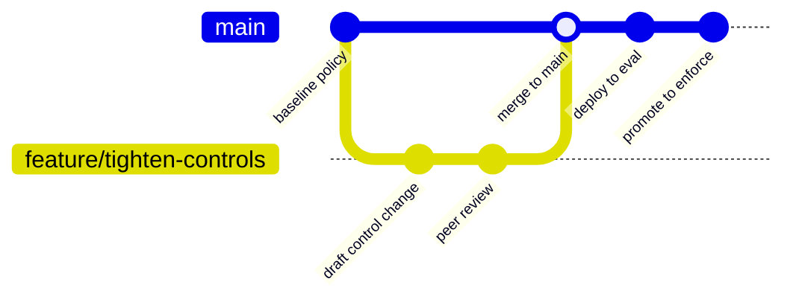

<GovernanceFactor title="Governance is Version Controlled" number={3}>

<Principle>

Treat governance artefacts with the same care and approach as code: it should be versioned, testable, reviewable, composable
and deployable.

</Principle>

<Problem>

Software changes continuously. Governance often does not.

As applications evolve, governance captured in documents, spreadsheets or wiki pages gradually diverges from the systems it is supposed to describe. Engineers implement new behaviour while policies remain unchanged, exceptions accumulate without review and evidence becomes difficult to relate to the version of the system that produced it.

In regulated environments this creates a fundamental problem: organisations can no longer answer simple questions such as "Which governance definition authorised this deployment?" or "Which version of the approval policy was in force when this decision was made?"

Governance that cannot evolve with software inevitably becomes either documentation or bureaucracy.

</Problem>

<Characteristics>

<RevealItem title="Review Like Code" defaultOpen>

Governance changes should be proposed, reviewed and approved before they become
operational. Pull requests, peer review and approval workflows create a
transparent history of who changed governance, why it changed and when it took
effect.

</RevealItem>

<RevealItem title="Test Before You Trust">

Governance should be validated before it is relied upon. Policies, controls and
governance artefacts should be automatically checked for correctness and
exercised against representative scenarios to ensure they behave as intended.

</RevealItem>

<RevealItem title="Promote Through Environments">

Governance should move through development, testing and production alongside the
systems it governs. Promoting governance through controlled environments
improves confidence while providing a clear record of which governance
definition was active at any point in time.

</RevealItem>

<RevealItem title="Manage Exceptions Explicitly">

Temporary departures from normal governance should be treated as governance
artefacts in their own right. Every exception should have an owner, a rationale,
an approval, a defined scope and an expiry date so that exceptional behaviour
remains visible, auditable and temporary.

</RevealItem>

</Characteristics>

<PositiveExamples>

<RevealItem title="Policies in Git">
Plaintext policy that can be diffed, reviewed and promoted like any other code
change, with history that auditors can follow.
</RevealItem>

<RevealItem title="Machine-readable control profiles">
Control catalogues and profiles that tools can validate and compose without
reconstructing PDF narratives.
</RevealItem>

<RevealItem title="Exceptions with pull requests and expiry dates">
Deviations tracked as reviewable artefacts with an explicit lifecycle, not
tribal memory.
</RevealItem>

<RevealItem title="Signed provenance and assessment results">
Build claims and assessment outputs stored as first-class, verifiable artefacts.
</RevealItem>

</PositiveExamples>

<NegativeExamples>

<RevealItem title="Screenshot-based evidence packs">
Evidence that cannot be diffed, verified or regenerated from the system of
record.
</RevealItem>

<RevealItem title="PDF-only controls">
Controls trapped in prose formats that machines cannot execute or compose.
</RevealItem>

<RevealItem title="Untracked policy edits in wikis">
Silent changes with no review history, tests or rollback path.
</RevealItem>

</NegativeExamples>

<AntiPatterns>

<RevealItem title="Governance by attachment">

The “real” policy lives in an email or SharePoint folder while systems run on
something else. Nobody can say which version was in force.

</RevealItem>

<RevealItem title="Copy-paste policy forks">

Each team forks the baseline into a private document. Divergence grows until the
enterprise standard is a rumour.

</RevealItem>

<RevealItem title="Evidence captured after the fact">

Definitions and results exist only when someone remembers to write them down for
an audit—too late to govern change.

</RevealItem>

</AntiPatterns>

<Diagram
  title="How does governance evolve?"
  description="Treat definitions like code: branch, review, merge and promote alongside the software they govern."
>

</Diagram>

<Discussion>

Applying this principle means putting operational governance on the same rails
as software delivery.

1. **Store** twin-bound policies, controls and exceptions as plaintext artefacts.
2. **Review** changes through the same pull-request discipline as application code.
3. **Test** where possible—schema validation, policy unit tests, dry-run evaluation.
4. **Promote** through environments; do not hot-edit production definitions.
5. **Retain history** so evidence can cite which definition was in force when a
   decision was made.

This factor does not claim every moral judgement becomes code. It claims the
operational part of governance should be versioned like the systems it governs.

</Discussion>

<RelatedFactors>

Version control is how definitions stay honest as the rest of the model scales:

- [Build a Governance Twin](/docs/factors/build-a-governance-twin) — what those versioned artefacts attach to
- [Governance Is Composable](/docs/factors/governance-is-composable) — how smaller artefacts combine without fork chaos
- [Evidence by Default](/docs/factors/evidence-by-default) — emitted evidence that cites definition versions
- [Continuous Governance](/docs/factors/continuous-governance) — deploying and evaluating definitions in the path of change
- [Facts In, Decisions Out](/docs/factors/facts-in-decisions-out) — executable decision logic stored as artefacts

</RelatedFactors>

<References>

- [OSCAL](/docs/tools/oscal) — machine-readable controls, profiles and assessment results
- [Gemara](/docs/tools/gemara) — versioned layered GRC artefacts
- [Open Policy Agent](/docs/tools/open-policy-agent) — policies as testable code
- [Cedar](/docs/tools/cedar) — reviewable authorisation policy as code
- [CI/CD](/docs/tools/ci-cd) — validate and promote governance through environments
- [SLSA](/docs/tools/slsa) — provenance as a verifiable artefact
- [in-toto](/docs/tools/in-toto) — signed supply-chain layouts and links

</References>

</GovernanceFactor>
