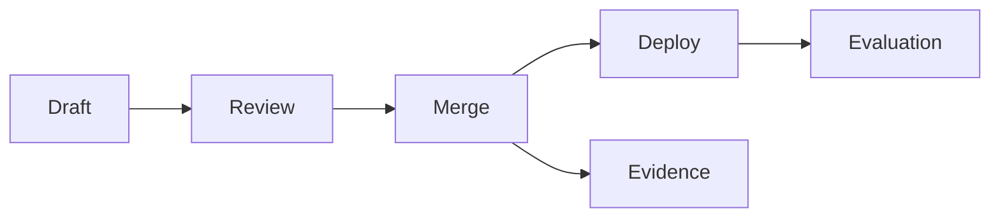

<GovernanceFactor title="Governance is Version Controlled">

<Principle>
Treat governance artefacts as code: versioned, testable, reviewable, composable and deployable.
</Principle>

<Problem>

When the operational part of governance lives in screenshots, PDFs, spreadsheets
or untracked wiki edits, it cannot be diffed, reviewed, validated or deployed
with the systems it governs. Human-readable prose still matters, but an
executable source of truth trapped in attachments does not keep up with modern
delivery.

</Problem>

<PositiveExamples>

- Policies in Git
- OSCAL control profiles in YAML
- Exceptions with pull requests and expiry dates
- Signed provenance documents
- Machine-readable assessment results

</PositiveExamples>

<NegativeExamples>

- Screenshot-based evidence packs
- PDF-only controls
- Spreadsheet-only exception logs
- Untracked policy edits in wikis

</NegativeExamples>

<Tools>

- OSCAL
- Gemara schemas
- OPA / Rego
- Cedar
- SLSA
- in-toto

</Tools>

<AntiPatterns>

- Governance by attachment
- Copy-paste policy forks
- Evidence captured after the fact

</AntiPatterns>

<Diagram>

Operational governance artefacts should move through draft, review, merge and deploy like code.

</Diagram>

<Discussion>

The practical case for this factor is already well established in the standards
space. OSCAL publishes controls, profiles, SSPs and assessment results in
machine-readable formats. Gemara does the same for layered GRC artefacts. OPA
and Cedar assume policies are stored and validated as code-like assets. SLSA and
in-toto serialise provenance and attestation claims as verifiable artefacts.
Across those ecosystems, the direction is the same: governance that cannot be
diffed, reviewed, validated and deployed by machines does not keep up with
modern delivery.

For the microsite, the key point is not that every moral judgement becomes code.
It is that the operational part of governance should use the disciplines that
already make software reliable: plaintext, version history, tests, review,
promotion and rollback. Human-readable policy still matters, but the executable
source of truth should not be trapped in prose.

</Discussion>

<RelatedPrinciples>

- Governance as Code
- Open Standards First
- Exceptions as Code
- Portable Open Artefacts
- Immutable Histories
- [Governance Is Composable](/docs/factors/governance-is-composable)
- [Evidence by Default](/docs/factors/evidence-by-default)
- [Continuous Governance](/docs/factors/continuous-governance)

</RelatedPrinciples>

<Interactions>

This factor enables [Governance Is Composable](/docs/factors/governance-is-composable),
[Evidence by Default](/docs/factors/evidence-by-default) and
[Continuous Governance](/docs/factors/continuous-governance).

</Interactions>

<References>

- [OSCAL](https://pages.nist.gov/OSCAL/)
- [Gemara](https://gemara.openssf.org/)
- [Open Policy Agent](https://www.openpolicyagent.org/)
- [Cedar](https://www.cedarpolicy.com/)
- [SLSA](https://slsa.dev/)
- [in-toto](https://in-toto.io/)

</References>

</GovernanceFactor>
