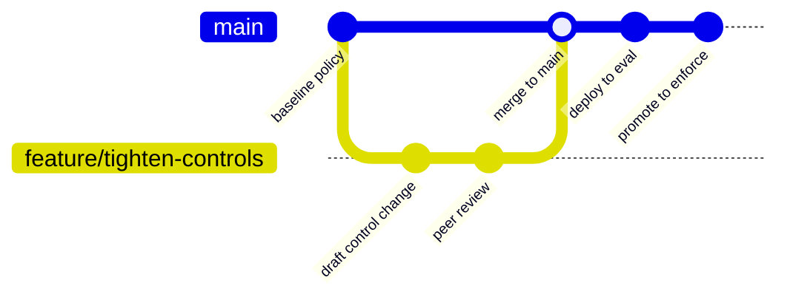

<GovernanceFactor title="Governance is Version Controlled" number={3}>

<Principle>
Treat governance artefacts as code: versioned, testable, reviewable, composable and deployable.
</Principle>

<Problem>

When the operational part of governance lives in screenshots, PDFs, spreadsheets
or untracked wiki edits, it cannot be diffed, reviewed, validated or deployed
with the systems it governs. Human-readable prose still matters, but an
executable source of truth trapped in attachments does not keep up with modern
delivery.

</Problem>

<PositiveExamples>

<RevealItem title="Policies in Git">
Plaintext policy that can be diffed, reviewed and promoted like any other code change.
</RevealItem>

<RevealItem title="OSCAL control profiles in YAML">
Machine-readable control catalogues and profiles that tools can validate and compose.
</RevealItem>

<RevealItem title="Exceptions with pull requests and expiry dates">
Deviations tracked as reviewable artefacts with an explicit lifecycle, not tribal memory.
</RevealItem>

<RevealItem title="Signed provenance documents">
Verifiable build and release claims stored as first-class artefacts.
</RevealItem>

<RevealItem title="Machine-readable assessment results">
Assessment outputs that systems can consume without reconstructing PDF narratives.
</RevealItem>

</PositiveExamples>

<NegativeExamples>

<RevealItem title="Screenshot-based evidence packs">
Evidence that cannot be diffed, verified or regenerated from the system of record.
</RevealItem>

<RevealItem title="PDF-only controls">
Controls trapped in prose formats that machines cannot execute or compose.
</RevealItem>

<RevealItem title="Spreadsheet-only exception logs">
Exception state that drifts, forks and disappears outside version control.
</RevealItem>

<RevealItem title="Untracked policy edits in wikis">
Silent changes with no review history, tests or rollback path.
</RevealItem>

</NegativeExamples>

<Tools>

- OSCAL
- Gemara schemas
- OPA / Rego
- Cedar
- SLSA
- in-toto

</Tools>

<AntiPatterns>

- Governance by attachment
- Copy-paste policy forks
- Evidence captured after the fact

</AntiPatterns>

<Diagram
  title="How does governance evolve?"
  description="Treat definitions like code: branch, review, merge and promote alongside the software they govern."
>

</Diagram>

<Discussion>

The practical case for this factor is already well established in the standards
space. OSCAL publishes controls, profiles, SSPs and assessment results in
machine-readable formats. Gemara does the same for layered GRC artefacts. OPA
and Cedar assume policies are stored and validated as code-like assets. SLSA and
in-toto serialise provenance and attestation claims as verifiable artefacts.
Across those ecosystems, the direction is the same: governance that cannot be
diffed, reviewed, validated and deployed by machines does not keep up with
modern delivery.

For Ten Factor Governance, the key point is not that every moral judgement becomes code.
It is that the operational part of governance should use the disciplines that
already make software reliable: plaintext, version history, tests, review,
promotion and rollback. Human-readable policy still matters, but the executable
source of truth should not be trapped in prose.

</Discussion>

<RelatedFactors>

- Governance as Code
- Open Standards First
- Exceptions as Code
- Portable Open Artefacts
- Immutable Histories
- [Governance Is Composable](/docs/factors/governance-is-composable)
- [Evidence by Default](/docs/factors/evidence-by-default)
- [Continuous Governance](/docs/factors/continuous-governance)

</RelatedFactors>

<Interactions>

This factor enables [Governance Is Composable](/docs/factors/governance-is-composable),
[Evidence by Default](/docs/factors/evidence-by-default) and
[Continuous Governance](/docs/factors/continuous-governance).

</Interactions>

<References>

- [OSCAL](https://pages.nist.gov/OSCAL/)
- [Gemara](https://gemara.openssf.org/)
- [Open Policy Agent](https://www.openpolicyagent.org/)
- [Cedar](https://www.cedarpolicy.com/)
- [SLSA](https://slsa.dev/)
- [in-toto](https://in-toto.io/)

</References>

</GovernanceFactor>
