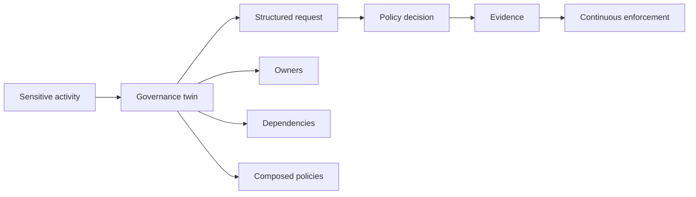

# The Factors

Ten Factor Governance is an architecture, not a slogan list. Sensitive activities
define where governance bites; a twin binds governance to real things;
versioned artefacts make it operable; request/decision boundaries keep it
explicit; evidence and continuous evaluation keep it live; ownership,
dependencies and composition keep it workable at organisational scale.

## How the factors fit together

A practical mental model is simple: identify a sensitive activity; bind it to
the concrete thing that will perform it; feed a structured request into a policy
engine; produce an explicit result; emit evidence; enforce or remediate
continuously; and attribute every exception, dependency and ownership link to
named entities.

Taken together, the ten factors answer ten different questions: what introduces
risk, what is being governed, how governance is managed as code, which domains
must be separated, how decisions are formed, why state is trusted, how
governance acts continuously, where risk is inherited, how governance scales,
and who is accountable.

## Who should read this?

Anyone designing, implementing or reviewing governance for systems that run as
services—platform engineers, security and risk practitioners, architects, and
open-source maintainers who need portable, inspectable decisioning rather than
tribal process.

## How each factor is written

Each factor page uses a fixed template: principle, problem, positive and
negative examples, tools, anti-patterns, diagram, discussion, related ideas,
interactions with other factors, and references. Read them as a set; the
interactions sections are intentional.

The most distinctive unifying metaphor remains
[Build a Governance Twin](/docs/factors/build-a-governance-twin): not a mirror
of everything, but a live representation of governance-relevant state for real
resources and sensitive activities.

## The factors

<FactorList />
