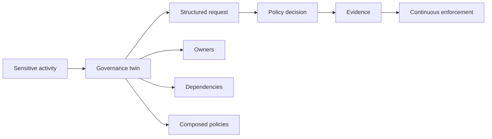

# Introduction to Governance Factors

This site consolidates ten governance factors into a microsite-ready set. The
factors are framed in plain language, but they line up with a recognisable body
of prior art: Gemara’s activity-centred GRC model; OSCAL’s machine-readable
controls, profiles and assessments; SLSA and in-toto provenance; Backstage and
CMDB-style typed inventories; OPA, Gatekeeper, Cedar, XACML and DMN for policy
decisions; and SBOM standards such as CycloneDX for dependency visibility. The
distinctive contribution is not any one ingredient in isolation, but their
combination into a live “governance twin” approach that binds policy, evidence
and decisions to real resources and sensitive activities.

Read the factors as an architecture, not a slogan list. Sensitive activities
define where governance bites; versioned artefacts make it operable; twins bind
it to real things; request/decision boundaries keep it explicit; evidence and
continuous evaluation keep it live; ownership, dependencies and composition keep
it workable at organisational scale.

## How the factors fit together

A practical mental model is simple: identify a sensitive activity; bind it to
the concrete thing that will perform it; feed a structured request into a policy
engine; produce an explicit result; emit evidence; enforce or remediate
continuously; and attribute every exception, dependency and ownership link to
named entities.

Taken together, the ten factors answer ten different questions: what introduces
risk, how governance is managed, what is being governed, which domains must be
separated, how decisions are formed, why state is trusted, how governance acts
continuously, where risk is inherited, how governance scales, and who is
accountable.

## Background

The goal is the same spirit as methodologies like the
[Twelve-Factor App](https://12factor.net): raise awareness of systemic failure
modes, give teams a shared vocabulary, and offer broad conceptual solutions with
stable names. The work is discussed in the context of the FINOS CCC (Change
Coordination Committee), but the factors are not FINOS-specific.

The most distinctive factor remains
[Build a Governance Twin](./factors/build-a-governance-twin.mdx). The surrounding
prior art is already rich, but the “twin” idea provides a memorable unifying
metaphor: not a mirror of everything, but a live representation of
governance-relevant state for real resources and sensitive activities.

## Who should read this?

Anyone designing, implementing or reviewing governance for systems that run as
services—platform engineers, security and risk practitioners, architects, and
open-source maintainers who need portable, inspectable decisioning rather than
tribal process.

## How each factor is written

Each factor page uses a fixed template: principle, problem, positive and
negative examples, tools, anti-patterns, diagram, discussion, related ideas,
interactions with other factors, and references. Read them as a set; the
interactions sections are intentional.

## The Ten Factors

<FactorList />
